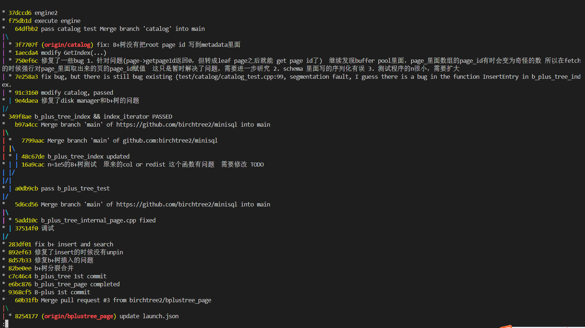
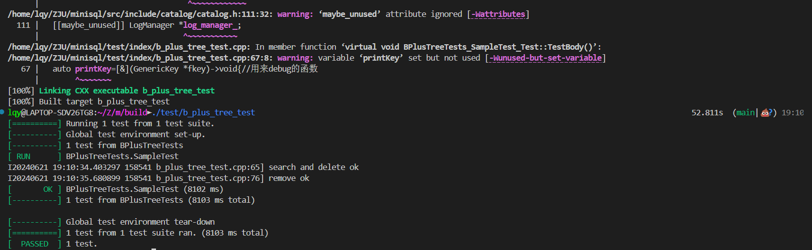
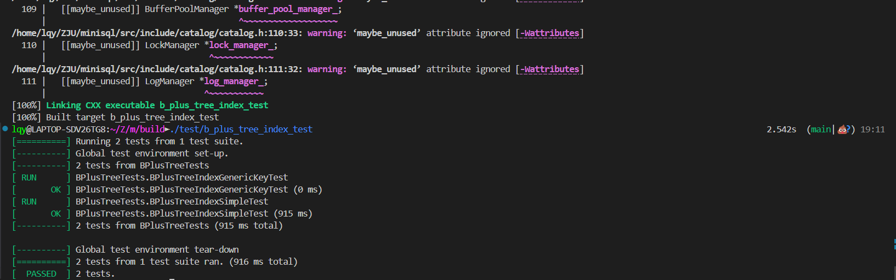

# Part 3: Index

小组成员：李秋宇 杨培源 吴欣玥

本部分负责人：李秋宇

[TOC]

---

## 基本信息

本模块实现一个索引，负责数据表的索引实现和管理

---

## 模块功能实现

### 数据页实现

#### `BPlusTreePage`

这里实现的是B+树节点的公共父类，是内部节点和叶子节点具有的共同成员变量和方法的视线

实现的难度和任务量不大，只要根据已经给出的函数声明完成对应的操作即可，都是一些`get`方法和`set`方法

直接给出实现：

```cpp
#include "page/b_plus_tree_page.h"

/*
 * Helper methods to get/set page type
 * Page type enum class is defined in b_plus_tree_page.h
 */
/**
 * TODO: Student Implement
 */
bool BPlusTreePage::IsLeafPage() const {
  return page_type_ == IndexPageType::LEAF_PAGE;
}

/**
 * TODO: Student Implement
 */
bool BPlusTreePage::IsRootPage() const {
  return GetParentPageId() == INVALID_PAGE_ID;
}

/**
 * TODO: Student Implement
 */
void BPlusTreePage::SetPageType(IndexPageType page_type) {
  page_type_ = page_type;
}

int BPlusTreePage::GetKeySize() const {
  return key_size_;
}

void BPlusTreePage::SetKeySize(int size) {
  key_size_ = size;
}

/*
 * Helper methods to get/set size (number of key/value pairs stored in that
 * page)
 */
int BPlusTreePage::GetSize() const {
  return size_;
}

void BPlusTreePage::SetSize(int size) {
  size_ = size;
}

void BPlusTreePage::IncreaseSize(int amount) {
  size_ += amount;
}

/*
 * Helper methods to get/set max size (capacity) of the page
 */
/**
 * TODO: Student Implement
 */
int BPlusTreePage::GetMaxSize() const {
  return max_size_;
}

/**
 * TODO: Student Implement
 */
void BPlusTreePage::SetMaxSize(int size) {
  max_size_ = size;
}

/*
 * Helper method to get min page size
 * Generally, min page size == max page size / 2
 */
/**
 * TODO: Student Implement
 */
int BPlusTreePage::GetMinSize() const {
  return max_size_ / 2;
}

/*
 * Helper methods to get/set parent page id
 */
/**
 * TODO: Student Implement
 */
page_id_t BPlusTreePage::GetParentPageId() const {
  return parent_page_id_;
}

void BPlusTreePage::SetParentPageId(page_id_t parent_page_id) {
  parent_page_id_ = parent_page_id;
}

/*
 * Helper methods to get/set self page id
 */
page_id_t BPlusTreePage::GetPageId() const {
  return page_id_;
}

void BPlusTreePage::SetPageId(page_id_t page_id) {
  page_id_ = page_id;
}

/*
 * Helper methods to set lsn
 */
void BPlusTreePage::SetLSN(lsn_t lsn) {
  lsn_ = lsn;
}
```

#### `BPlusTreeInternalPage`

这里是B+树的内部节点的实现

##### 内部节点初始化

初始化方法，主要将当前节点相关参数进行设定，其中`size=0`和`PageType=IndexPageType::INTERNAL_PAGE`，用于标记内部节点

```cpp
void InternalPage::Init(page_id_t page_id, page_id_t parent_id, int key_size, int max_size) {
  SetPageId(page_id);
  SetParentPageId(parent_id);
  SetKeySize(key_size);
  SetMaxSize(max_size);
  SetSize(0);
  SetPageType(IndexPageType::INTERNAL_PAGE);
}
```

##### 内部节点查找

查找是最基本的操作，在这里传入`GenericKey`和一个`KeyManager`进行查找

因为节点内也是有序的，相当于一个小的数组，所以采用二分查找来加快节点内部的扫描

特殊情况：

* 如果当前页节点大小为0，表明为空节点，直接返回；
* 如果只有一个节点，直接返回
* 如果要的节点比第一个还小，说明肯定不在这个节点内，也直接返回

```cpp
page_id_t InternalPage::Lookup(const GenericKey *key, const KeyManager &KM) {
  int l=1,r=GetSize()-1,mid,ans=GetSize();//l=1是因为第一个key是无效的
  if(GetSize()==0) return INVALID_PAGE_ID;
  if(GetSize()==1) return ValueAt(0);
  if(KM.CompareKeys(key,KeyAt(1))<0) return ValueAt(0);
  //如果key比第一个key还小，那么返回第一个value指针
  /*按照顺序存储 m个键和m+1个指针（这些指针记录的是⼦结点的 page_id ）。由于键和指针的数量不相等，因此我们需
要将第⼀个键设置为INVALID，也就是说，顺序查找时需要从第2个键开始查找
         | 0  | 1 | 2  |
    key  | /  | a | b  |
    value| x  | y | z  |
  */
  //用二分，找到最后一个<=key的位置
  while(l<=r){
    mid=(l+r)/2;
    if(KM.CompareKeys(KeyAt(mid),key)<=0){
      ans=mid;
      l=mid+1;
    }else r=mid-1;
  }
  return ValueAt(ans);
}
```

##### 内部节点插入

对于内部节点的插入，正常情况下只需要直接插入即可，由`InsertNodeAfter`实现

首先找到要插入的位置，然后把后续的点往后挪，最后`size`加一即可

如果出现插入导致溢出，这里在插入的方法中还需要实现一个`PopulateNewRoot`的方法，表明插入导致根节点发生变化

把对应的键值对往新根上提

```cpp
/*
 * Populate new root page with old_value + new_key & new_value
 * When the insertion cause overflow from leaf page all the way upto the root
 * page, you should create a new root page and populate its elements.
 * NOTE: This method is only called within InsertIntoParent()(b_plus_tree.cpp)
 */
void InternalPage::PopulateNewRoot(const page_id_t &old_value, GenericKey *new_key, const page_id_t &new_value) {
  SetSize(2);//size=value个数=key个数+1
  // SetKeyAt(0,nullptr); //memcpy空指针会出错
  SetKeyAt(1,new_key);
  SetValueAt(0, old_value);
  SetValueAt(1,new_value);
}

/* CP
 * Insert new_key & new_value pair right after the pair with its value ==
 * old_value
 * @return:  new size after insertion
 */
int InternalPage::InsertNodeAfter(const page_id_t &old_value, GenericKey *new_key, const page_id_t &new_value) {
  int index=ValueIndex(old_value);
  //先右移，后插入到index+1位置
  PairCopy(PairPtrAt(index+2),PairPtrAt(index+1),GetSize()-index-1);
  SetKeyAt(index+1, new_key);
  SetValueAt(index+1, new_value);
  IncreaseSize(1);
  return GetSize();
}
```

##### 内部节点分裂

分裂需要移动一半的元素到新的节点`recipient`上，这里由`MoveHalfTo`方法实现

在这个方法内调用了`CopyNFrom`方法，是移动这些节点到分裂出的节点上的具体做法，把对应的键值对一一拷贝过来，然后把原来的`size`减半而不需要删除，把复制过来的子节点的父节点更新即可

```cpp
/*
 * Remove half of key & value pairs from this page to "recipient" page
 * buffer_pool_manager 是干嘛的？传给CopyNFrom()用于Fetch数据页
 */
void InternalPage::MoveHalfTo(InternalPage *recipient, BufferPoolManager *buffer_pool_manager) {
  int size=GetSize();//把后size/2个元素移动到recipient
  recipient->CopyNFrom(PairPtrAt(size-size/2),size/2,buffer_pool_manager);
  IncreaseSize(-size/2);
}

/* Copy entries into me, starting from {items} and copy {size} entries.
 * Since it is an internal page, for all entries (pages) moved, their parents page now changes to me.
 * So I need to 'adopt' them by changing their parent page id, which needs to be persisted with BufferPoolManger
 *
 */
void InternalPage::CopyNFrom(void *src, int size, BufferPoolManager *buffer_pool_manager) {
  int pos=GetSize();//从当前size的位置开始插入
  PairCopy(PairPtrAt(pos),src,size);
  IncreaseSize(size);
  //对于复制过来的子节点，要把他门的父节点更新成当前Page
  for(int i=0;i<size;i++){
    page_id_t page_id=ValueAt(pos+i);//id
    Page *page=buffer_pool_manager->FetchPage(page_id);//fetch->修改->unPin
    if(page==nullptr){
      LOG(INFO)<<"CopyNFrom fetch page failed";
      return;
    }
    InternalPage *internal_page=reinterpret_cast<InternalPage *>(page->GetData());
    internal_page->SetParentPageId(GetPageId());
    buffer_pool_manager->UnpinPage(page_id,true);
  }
}
```

##### 内部节点删除

删除把后面的键值对往前挪，同时`size`减少一个

```cpp
/*
 * Remove the key & value pair in internal page according to input index(a.k.a
 * array offset)
 * NOTE: store key&value pair continuously after deletion
 */
void InternalPage::Remove(int index) {
  PairCopy(PairPtrAt(index),PairPtrAt(index+1),GetSize()-index-1);
  IncreaseSize(-1);
}

/*
 * Remove the only key & value pair in internal page and return the value
 * NOTE: only call this method within AdjustRoot()(in b_plus_tree.cpp)
 */
page_id_t InternalPage::RemoveAndReturnOnlyChild() {
  if(GetSize()!=1){
    LOG(INFO)<<"RemoveAndReturnOnlyChild not only child";
    return INVALID_PAGE_ID;
  }
  page_id_t value=ValueAt(0);
  Remove(0);
  return value;
}
```

##### 内部节点合并

合并就是把节点中的所有移动到`recipient`中，调用两个`copy`函数即可

```cpp
/*
 * Remove all of key & value pairs from this page to "recipient" page.
 * The middle_key is the separation key you should get from the parent. You need
 * to make sure the middle key is added to the recipient to maintain the invariant.
 * You also need to use BufferPoolManager to persist changes to the parent page id for those
 * pages that are moved to the recipient
 */
void InternalPage::MoveAllTo(InternalPage *recipient, GenericKey *middle_key, BufferPoolManager *buffer_pool_manager) {
  recipient->CopyLastFrom(middle_key,ValueAt(0),buffer_pool_manager);
  recipient->CopyNFrom(PairPtrAt(1),GetSize()-1,buffer_pool_manager);
  buffer_pool_manager->DeletePage(GetPageId());
}
```

##### 内部节点调整

如函数名所示，移动第一个键值对到末尾

```cpp
/*****************************************************************************
 * REDISTRIBUTE
 *****************************************************************************/
/*
 * Remove the first key & value pair from this page to tail of "recipient" page.
 *
 * The middle_key is the separation key you should get from the parent. You need
 * to make sure the middle key is added to the recipient to maintain the invariant.
 * You also need to use BufferPoolManager to persist changes to the parent page id for those
 * pages that are moved to the recipient
 */
void InternalPage::MoveFirstToEndOf(InternalPage *recipient, GenericKey *middle_key,
                                    BufferPoolManager *buffer_pool_manager) {
    recipient->CopyLastFrom(middle_key,ValueAt(0),buffer_pool_manager);//插到末尾
    Remove(0);//自己删除value(0)
                      
}

/* Append an entry at the end.
 * Since it is an internal page, the moved entry(page)'s parent needs to be updated.
 * So I need to 'adopt' it by changing its parent page id, which needs to be persisted with BufferPoolManger
 */
void InternalPage::CopyLastFrom(GenericKey *key, const page_id_t value, BufferPoolManager *buffer_pool_manager) {
  int pos=GetSize();
  SetKeyAt(pos,key);
  SetValueAt(pos,value);
  IncreaseSize(1);
  Page *page=buffer_pool_manager->FetchPage(value);
  if(page==nullptr){
    LOG(INFO)<<"CopyLastFrom fetch page failed";
    return;
  }
  InternalPage *internal_page=reinterpret_cast<InternalPage *>(page->GetData());
  internal_page->SetParentPageId(GetPageId());
  buffer_pool_manager->UnpinPage(value,true);
}

/*
 * Remove the last key & value pair from this page to head of "recipient" page.
 * You need to handle the original dummy key properly, e.g. updating recipient’s array to position the middle_key at the
 * right place.
 * You also need to use BufferPoolManager to persist changes to the parent page id for those pages that are
 * moved to the recipient
 */
void InternalPage::MoveLastToFrontOf(InternalPage *recipient, GenericKey *middle_key,
                                     BufferPoolManager *buffer_pool_manager) {
    recipient->CopyFirstFrom(ValueAt(GetSize()-1),buffer_pool_manager);//插到开头作为key,不需要value
    Remove(GetSize()-1);//删除最后一个value
    recipient->SetKeyAt(1,middle_key);//更新middle_key
    
}

/* Append an entry at the beginning.
 * Since it is an internal page, the moved entry(page)'s parent needs to be updated.
 * So I need to 'adopt' it by changing its parent page id, which needs to be persisted with BufferPoolManger
 */
void InternalPage::CopyFirstFrom(const page_id_t value, BufferPoolManager *buffer_pool_manager) {
  InsertNodeAfter(INVALID_PAGE_ID, KeyAt(0), value);//????? 我不理解
  Page *page=buffer_pool_manager->FetchPage(value);
  if(page==nullptr){
    LOG(INFO)<<"CopyLastFrom fetch page failed";
    return;
  }
  InternalPage *internal_page=reinterpret_cast<InternalPage *>(page->GetData());
  internal_page->SetParentPageId(GetPageId());
  buffer_pool_manager->UnpinPage(value,true);
}
```

#### `BPlusTreeLeafPage`

这里是B+树的叶子节点模块实现，方法与内部节点类似，只有略微不同

##### 叶子节点初始化

与内部节点实现一致，类型不一样

同时叶子节点在最底层是用指针连在一起的

```cpp
/**
 * Init method after creating a new leaf page
 * Including set page type, set current size to zero, set page id/parent id, set
 * next page id and set max size
 * 未初始化next_page_id
 */
void LeafPage::Init(page_id_t page_id, page_id_t parent_id, int key_size, int max_size) {
  SetPageId(page_id);
  SetParentPageId(parent_id);
  SetKeySize(key_size);
  SetMaxSize(max_size);
  SetNextPageId(INVALID_PAGE_ID);// 未初始化next_page_id
  SetSize(0);// 初始化size为0，因为是新建的叶子节点
  SetPageType(IndexPageType::LEAF_PAGE);// 设置为叶子节点
}
```

##### 叶子节点查找

先实现一个方法是查找节点内的键对应的索引下标，也是用的二分查找

然后真正在`LookUp`里面直接调用即可

```cpp
/**
 * Helper method to find the first index i so that pairs_[i].first >= key
 * NOTE: This method is only used when generating index iterator
 * 二分查找
 */
int LeafPage::KeyIndex(const GenericKey *key, const KeyManager &KM) {
  int l=0,r=GetSize()-1,ans=r+1,mid;
  while(l<=r){
    mid=(l+r)/2;
    if(KM.CompareKeys(KeyAt(mid),key)>=0){
      ans=mid;//pairs[mid].first>=key
      r=mid-1;
    }else{
      l=mid+1;
    }
  }
  return ans;
}

/*
 * For the given key, check to see whether it exists in the leaf page. If it
 * does, then store its corresponding value in input "value" and return true.
 * If the key does not exist, then return false
 */
bool LeafPage::Lookup(const GenericKey *key, RowId &value, const KeyManager &KM) {
  int index=KeyIndex(key,KM);
  if(index>=GetSize()) return false;
  if(KM.CompareKeys(KeyAt(index),key)==0){
    value=ValueAt(index);
    return true;
  }
  return false;
}
```

##### 叶子节点插入

如果是空节点，直接插入就完事

如果不是空节点，需要插入到对应位置

```cpp
/*
 * Insert key & value pair into leaf page ordered by key
 * @return page size after insertion
 */
int LeafPage::Insert(GenericKey *key, const RowId &value, const KeyManager &KM) {
  if(GetSize()==0){//结点为空
    SetKeyAt(0,key);
    SetValueAt(0,value);
    IncreaseSize(1);
    return 1;
  }
  int index = KeyIndex(key, KM);
  PairCopy(PairPtrAt(index+1),PairPtrAt(index),GetSize()-index);// 将index及之后的元素后移
  SetKeyAt(index, key);
  SetValueAt(index, value);
  IncreaseSize(1);
  return GetSize();
}
```

##### 叶子节点分裂

同内部节点实现方法

```cpp
/*
 * Remove half of key & value pairs from this page to "recipient" page
 */
void LeafPage::MoveHalfTo(LeafPage *recipient) {
  int size=GetSize();//把后size/2个元素移动到recipient
  recipient->CopyNFrom(PairPtrAt(size-size/2),size/2);
  IncreaseSize(-(size/2));
}

/*
 * Copy starting from items, and copy {size} number of elements into me.
 */
void LeafPage::CopyNFrom(void *src, int size) {
  int pos=GetSize();//从当前size的位置开始插入
  PairCopy(PairPtrAt(pos),src,size);
  IncreaseSize(size);
}
```

##### 叶子节点删除

首先看是否存在这个待删除的值，不存在直接返回

然后也是把删除后的后续键值对前移

```cpp
/*
 * First look through leaf page to see whether delete key exist or not. If
 * existed, perform deletion, otherwise return immediately.
 * NOTE: store key&value pair continuously after deletion
 * @return  page size after deletion
 */
int LeafPage::RemoveAndDeleteRecord(const GenericKey *key, const KeyManager &KM) {
  int index=KeyIndex(key,KM);
  if(index==GetSize()||KM.CompareKeys(KeyAt(index),key)!=0) return GetSize();//不存在
  PairCopy(PairPtrAt(index),PairPtrAt(index+1),GetSize()-index-1);//删除index位置的元素
  IncreaseSize(-1);
  return GetSize();
}
```

##### 叶子节点合并

同内部节点

```cpp
/*
 * Remove all key & value pairs from this page to "recipient" page. Don't forget
 * to update the next_page id in the sibling page
 */
void LeafPage::MoveAllTo(LeafPage *recipient) {
    recipient->CopyNFrom(PairPtrAt(0),GetSize());//先把当前page的所有元素移动到recipient
    recipient->SetNextPageId(GetNextPageId());
    SetSize(0);//清空当前page
}
```

##### 叶子节点调整

类似

```cpp
/*
 * Remove the first key & value pair from this page to "recipient" page.
 *
 */
void LeafPage::MoveFirstToEndOf(LeafPage *recipient) {
  recipient->CopyLastFrom(KeyAt(0),ValueAt(0));//把first元素移动到recipient
  PairCopy(PairPtrAt(0),PairPtrAt(1),GetSize()-1);//当前page的元素前移
  IncreaseSize(-1);
}

/*
 * Copy the item into the end of my item list. (Append item to my array)
 */
void LeafPage::CopyLastFrom(GenericKey *key, const RowId value) {
  int pos=GetSize();//因为是直接插到末尾，不需要移动
  SetKeyAt(pos,key);
  SetValueAt(pos,value);
  IncreaseSize(1);
}

/*
 * Remove the last key & value pair from this page to "recipient" page.
 */
void LeafPage::MoveLastToFrontOf(LeafPage *recipient) {
  //把last元素移动到recipient
  recipient->CopyFirstFrom(KeyAt(GetSize()-1),ValueAt(GetSize()-1));
  IncreaseSize(-1);
}

/*
 * Insert item at the front of my items. Move items accordingly.
 *
 */
void LeafPage::CopyFirstFrom(GenericKey *key, const RowId value) {
  PairCopy(PairPtrAt(1),PairPtrAt(0),GetSize());//需要所有元素后移1
  SetKeyAt(0,key);
  SetValueAt(0,value);
  IncreaseSize(1);
}
```

### 索引实现

实现数据页之后进行整个B+树的方法实现

#### 构造函数

开始一个新的B+树，从得到一个根节点开始，负责的工作是从`buffer_pool_manager`中得到一个页作为根节点，并定义大小

```cpp
BPlusTree::BPlusTree(index_id_t index_id, BufferPoolManager *buffer_pool_manager, const KeyManager &KM,
                     int leaf_max_size, int internal_max_size)
    : index_id_(index_id),
      buffer_pool_manager_(buffer_pool_manager),
      processor_(KM),
      leaf_max_size_(leaf_max_size),
      internal_max_size_(internal_max_size) {
  Page* pages = buffer_pool_manager_->FetchPage(INDEX_ROOTS_PAGE_ID);
  IndexRootsPage* index_roots_page = reinterpret_cast<IndexRootsPage*>(pages);
  index_roots_page->GetRootId(index_id, &root_page_id_);
  // LOG(ERROR)<<"index_id="<<index_id<<"new b+ tree root="<<root_page_id_;
  buffer_pool_manager_->UnpinPage(INDEX_ROOTS_PAGE_ID, true);
  if (leaf_max_size == UNDEFINED_SIZE)
    leaf_max_size_ = (PAGE_SIZE - LEAF_PAGE_HEADER_SIZE) / (processor_.GetKeySize() + sizeof(RowId));
  if (internal_max_size == UNDEFINED_SIZE)
    internal_max_size_ = (PAGE_SIZE - INTERNAL_PAGE_HEADER_SIZE) / (processor_.GetKeySize() + sizeof(page_id_t));
}
```

#### 摧毁

只需要从buffer中删掉要删除的页即可

```cpp
void BPlusTree::Destroy(page_id_t current_page_id) {
  buffer_pool_manager_->DeletePage(current_page_id);
  return ;
}
```

#### 空树判断

看一下根节点有没有定义即可

```cpp
bool BPlusTree::IsEmpty() const {
    return root_page_id_ == INVALID_PAGE_ID;
}
```

#### 查找

首先判断是否非空，然后在叶子节点中找

注意到这里传进来的`result`，本来以为外面没有清空，所以加上了`result.clear()`，以为考虑周全，结果事实上就是不用清空，不然会导致查询出错

```cpp
/*
 * Return the only value that associated with input key
 * This method is used for point query
 * @return : true means key exists
 */
bool BPlusTree::GetValue(const GenericKey *key, std::vector<RowId> &result, Txn *transaction) {
  if (IsEmpty()) return false; // Empty tree
  // result.clear(); result不用清空,每查一次就把结果放到最后面
  LeafPage *leaf_page = reinterpret_cast<LeafPage *>(FindLeafPage(key)->GetData());
  RowId rowid;
  bool is_found = leaf_page->Lookup(key, rowid, processor_);
  // Find the corresponding answer
  if (is_found) {
    result.push_back(rowid);
    // LOG(ERROR)<<rowid.GetPageId()<<" "<<rowid.GetSlotNum();
  }else{
    // LOG(ERROR)<<"not found";
  }
  
  buffer_pool_manager_->UnpinPage(leaf_page->GetPageId(), false);
  return is_found;
}
```

#### 插入

* 如果是空树，直接开一个新树
* 否则，插入到叶子节点，然后查看是否分裂

> `Split`方法在后面实现

```cpp
/*
 * Insert constant key & value pair into b+ tree
 * if current tree is empty, start new tree, update root page id and insert
 * entry, otherwise insert into leaf page.
 * @return: since we only support unique key, if user try to insert duplicate
 * keys return false, otherwise return true.
 */
bool BPlusTree::Insert(GenericKey *key, const RowId &value, Txn *transaction) {
  // Check if the tree is empty
  if (IsEmpty()) {
    StartNewTree(key, value);
    return true;
  } else {
    return InsertIntoLeaf(key, value, transaction);
  }
}
/*
 * Insert constant key & value pair into an empty tree
 * User needs to first ask for new page from buffer pool manager(NOTICE: throw
 * an "out of memory" exception if returned value is nullptr), then update b+
 * tree's root page id and insert entry directly into leaf page.
 */
void BPlusTree::StartNewTree(GenericKey *key, const RowId &value) {
  page_id_t new_page_id;
  Page* new_page = buffer_pool_manager_->NewPage(new_page_id);
  if (new_page == nullptr) throw ("out of memory"); // Out of memory exception.
  root_page_id_ = new_page_id;
  UpdateRootPageId(true);//记得更新meta page里面记录的root_page_id, 因为是新根,insert=true
  LeafPage *root_page = reinterpret_cast<LeafPage *>(new_page->GetData());
  root_page->Init(root_page_id_, INVALID_PAGE_ID, processor_.GetKeySize(), leaf_max_size_);
  root_page->Insert(key, value, processor_);
  buffer_pool_manager_->UnpinPage(new_page_id, true);
}

/*
 * Insert constant key & value pair into leaf page
 * User needs to first find the right leaf page as insertion target, then look
 * through leaf page to see whether insert key exist or not. If exist, return
 * immediately, otherwise insert entry. Remember to deal with split if necessary.
 * @return: since we only support unique key, if user try to insert duplicate
 * keys return false, otherwise return true.
 */
bool BPlusTree::InsertIntoLeaf(GenericKey *key, const RowId &value, Txn *transaction) {
  // Find the right leaf page
  LeafPage *leaf_page = reinterpret_cast<LeafPage *>(FindLeafPage(key)->GetData());
  // Check if the key already exists
  RowId rowid;
  if (leaf_page->Lookup(key, rowid, processor_)) {
    buffer_pool_manager_->UnpinPage(leaf_page->GetPageId(), false);
    return false; // Key already exists
  }
  // Insert the key & value pair
  leaf_page->Insert(key, value, processor_);
  // Check if split is necessary
  if (leaf_page->GetSize() > leaf_max_size_) {
    // Split the leaf page
    // LOG(ERROR)<<"Split";
    LeafPage *new_leaf_page = Split(leaf_page, transaction);
    leaf_page->SetNextPageId(new_leaf_page->GetPageId());//把当前叶子和新叶子连起来
    /*把分裂后新叶子最左侧的插入到父亲   调用keyAt(0)
    如[1,2,3,4]->  [3]
               [1,2] [3,4]                                              
    */
    InsertIntoParent(leaf_page, new_leaf_page->KeyAt(0), new_leaf_page, transaction);
    //记得unpin new leaf page
    buffer_pool_manager_->UnpinPage(new_leaf_page->GetPageId(),true);
  }
  buffer_pool_manager_->UnpinPage(leaf_page->GetPageId(), true);
  return true;
}
```

#### 分裂

分裂分为叶子节点的分裂和内部节点的分裂，对应实现了两个重载函数`Split`

* 对于内部节点分裂，从buffer拿一个新的页然后初始化，调用相关 移动键值对的方法
* 对于叶子节点的分裂，也是同理

特殊情况是内部节点的分裂，因为分裂完还要向上传递一个键值对，所以向父节点插入时还要判断是否是根节点的分裂

```cpp
/*
 * Split input page and return newly created page.
 * Using template N to represent either internal page or leaf page.
 * User needs to first ask for new page from buffer pool manager(NOTICE: throw
 * an "out of memory" exception if returned value is nullptr), then move half
 * of key & value pairs from input page to newly created page
 */
BPlusTreeInternalPage *BPlusTree::Split(InternalPage *node, Txn *transaction) {
  // New page.
  page_id_t new_page_id;
  Page* new_page = buffer_pool_manager_->NewPage(new_page_id);
  if (new_page == nullptr) throw ("out of memory"); // Out of memory exception.
  InternalPage *new_internal_page = reinterpret_cast<InternalPage *>(new_page->GetData());
  // Init.
  new_internal_page->Init(new_page_id, node->GetParentPageId(), processor_.GetKeySize(), internal_max_size_);
  // Split data.
  node->MoveHalfTo(new_internal_page, buffer_pool_manager_);
  // Unpin.
  // buffer_pool_manager_->UnpinPage(node->GetPageId(), true);
  //不需要unpin, 因为这个node在InsertIntoParent的时候还要用到
  return new_internal_page;
}

BPlusTreeLeafPage *BPlusTree::Split(LeafPage *node, Txn *transaction) {
  // New page.
  page_id_t new_page_id;
  Page* new_page = buffer_pool_manager_->NewPage(new_page_id);
  if (new_page == nullptr) throw ("out of memory"); // Out of memory exception.
  LeafPage *new_leaf_page = reinterpret_cast<LeafPage *>(new_page->GetData());
  // Init.
  new_leaf_page->Init(new_page_id, node->GetParentPageId(), processor_.GetKeySize(), leaf_max_size_);
  // Split data.
  node->MoveHalfTo(new_leaf_page);
  // Unpin.
  // buffer_pool_manager_->UnpinPage(node->GetPageId(), true);
  //不需要unpin, 因为这个node在InsertIntoParent的时候还要用到
  return new_leaf_page;
}

/*
 * Insert key & value pair into internal page after split
 * @param   old_node      input page from split() method
 * @param   key
 * @param   new_node      returned page from split() method
 * User needs to first find the parent page of old_node, parent node must be
 * adjusted to take info of new_node into account. Remember to deal with split
 * recursively if necessary.
 */
void BPlusTree::InsertIntoParent(BPlusTreePage *old_node, GenericKey *key, BPlusTreePage *new_node, Txn *transaction) {
  // If old_node is root page, create a new root page
  if (old_node->IsRootPage()) {
    // Create a new root page
    page_id_t new_page_id;
    Page* new_page = buffer_pool_manager_->NewPage(new_page_id);
    if (new_page == nullptr) throw ("out of memory"); // Out of memory exception.
    InternalPage *new_root_page = reinterpret_cast<InternalPage *>(new_page->GetData());
    // Init.
    new_root_page->Init(new_page_id, INVALID_PAGE_ID, old_node->GetKeySize(), internal_max_size_);
    new_root_page->PopulateNewRoot(old_node->GetPageId(), key, new_node->GetPageId());
    old_node->SetParentPageId(new_page_id);
    new_node->SetParentPageId(new_page_id);
    root_page_id_ = new_page_id;
    UpdateRootPageId(false);//更新meta page
    buffer_pool_manager_->UnpinPage(new_page_id, true);
  } else {
    // Find the parent page
    InternalPage *parent_page = reinterpret_cast<InternalPage *>(buffer_pool_manager_->FetchPage(old_node->GetParentPageId())->GetData());
    int size = parent_page->InsertNodeAfter(old_node->GetPageId(), key, new_node->GetPageId());
    // Keep iteration of split
    if (size >= internal_max_size_) {
      auto *new_internal_page = Split(parent_page, transaction);
      InsertIntoParent(parent_page, new_internal_page->KeyAt(0), new_internal_page, transaction);
      buffer_pool_manager_->UnpinPage(new_internal_page->GetPageId(),true);
    }
    buffer_pool_manager_->UnpinPage(parent_page->GetPageId(), true);
  }
  return ;
}
```

#### 删除

1. 判断非空
2. 查找对应元素
3. 删除
4. 判断特殊情况
   1. 合并：调用相关调整方法
   2. 删除了第一个元素，一路向上删除

```cpp
/*
 * Delete key & value pair associated with input key
 * If current tree is empty, return immediately.
 * If not, User needs to first find the right leaf page as deletion target, then
 * delete entry from leaf page. Remember to deal with redistribute or merge if
 * necessary.
 */
void BPlusTree::Remove(const GenericKey *key, Txn *transaction) {
  if (IsEmpty()) return ; // Empty tree
  // Find the right leaf page   (isLeftMost=false, 因为要根据key去查)
  LeafPage *leaf_page = reinterpret_cast<LeafPage *>(FindLeafPage(key, root_page_id_, false)->GetData());
  // Delete the key & value pair
  int del_index=leaf_page->KeyIndex(key, processor_);
  int new_size = leaf_page->RemoveAndDeleteRecord(key, processor_);
  // Check if merge is necessary
  bool flag=false;
  if (new_size < leaf_page->GetMinSize()) {
    // Merge the leaf page
    flag=CoalesceOrRedistribute<LeafPage>(leaf_page, transaction);
  } else if (!del_index) { // The deleted key is the first key, need pop up to delete.
    GenericKey *new_key = leaf_page->KeyAt(0); // New key to replace the old one.
    InternalPage *parent_page = reinterpret_cast<InternalPage *>(
      buffer_pool_manager_->FetchPage(leaf_page->GetParentPageId())->GetData()//勿忘GetData()
      );
    page_id_t pageid = leaf_page->GetPageId();
    // Pop up to delete
    if(parent_page!=nullptr){
      while (!parent_page->IsRootPage() && parent_page->ValueIndex(pageid) == 0) {
        buffer_pool_manager_->UnpinPage(parent_page->GetPageId(), false);
        pageid=parent_page->GetPageId();//应该get的是当前parent的page_id
        parent_page = reinterpret_cast<InternalPage *>(
          buffer_pool_manager_->FetchPage(parent_page->GetParentPageId())->GetData()
        );
      }
      int tmp_index = parent_page->ValueIndex(pageid);
      if (tmp_index != 0 && processor_.CompareKeys(parent_page->KeyAt(tmp_index), new_key) != 0) {
        parent_page->SetKeyAt(tmp_index, new_key);
        buffer_pool_manager_->UnpinPage(parent_page->GetPageId(), true);
      }
    }
  }
  buffer_pool_manager_->UnpinPage(leaf_page->GetPageId(), true);
  if(flag) buffer_pool_manager_->DeletePage(leaf_page->GetPageId());
}
```

#### 调整

用来调整更新后的B+树的方法，用于维持B+树的有序和平衡

1. 检查是否为根节点，如果是则直接调用根节点的调整方法
2. 如果当前节点的前后兄弟节点存在，且大小不够时，进行重新分配；对于内部节点的情况，还需要更新父节点的键
3. 合并：如果前一个兄弟节点存在则进行合并，对第一个节点的话就和后一个兄弟节点合并

```cpp
/* todo
 * User needs to first find the sibling of input page. If sibling's size + input
 * page's size > page's max size, then redistribute. Otherwise, merge.
 * Using template N to represent either internal page or leaf page.
 * @return: true means target leaf page should be deleted,
 * false means no deletion happens       
 */
template <typename N>
bool BPlusTree::CoalesceOrRedistribute(N *&node, Txn *transaction) {
  if (node->IsRootPage()) return AdjustRoot(node);//根节点  
  Page* parent_page=buffer_pool_manager_->FetchPage(node->GetParentPageId());
  InternalPage* parent=reinterpret_cast<InternalPage*>(parent_page->GetData());
  //获取兄弟节点
  int index=parent->ValueIndex(node->GetPageId());
  int pre_id=-1,nex_id=-1;
  N *pre, *nex;
  if(index>0){//对于中间的节点，必须分别检查index-1和index+1是否能merge
    pre_id=parent->ValueAt(index-1);
    pre=reinterpret_cast<N*>(buffer_pool_manager_->FetchPage(pre_id)->GetData());
    if(pre->GetSize()>pre->GetMinSize()){//有多的节点可以移动
      Redistribute(pre,node,1);
      BPlusTreePage* rnode_page=reinterpret_cast<BPlusTreePage*>(node);//找到右边的节点(node)
      if(rnode_page->IsLeafPage()==false){
        //如果是非叶子节点，要找到子树中最小值作为分割的key  而不是当前节点最小值
        InternalPage* rnode=reinterpret_cast<InternalPage*>(rnode_page);
        page_id_t minval = rnode->LeftMostKeyFromCurr(buffer_pool_manager_);
        LeafPage* leaf = reinterpret_cast<LeafPage*>(buffer_pool_manager_->FetchPage(minval));
        parent->SetKeyAt(index,leaf->KeyAt(0));
        buffer_pool_manager_->UnpinPage(leaf->GetPageId(),false);
      }
      buffer_pool_manager_->UnpinPage(pre->GetPageId(),true);
      buffer_pool_manager_->UnpinPage(parent->GetPageId(),true);
      return false;
    }
  }
  if(index<parent->GetSize()-1){
    nex_id=parent->ValueAt(index+1);
    nex=reinterpret_cast<N*>(buffer_pool_manager_->FetchPage(nex_id)->GetData());
    if(nex->GetSize()>nex->GetMinSize()){
      Redistribute(nex,node,0);//注意node在nex左边
      BPlusTreePage* rnode_page=reinterpret_cast<BPlusTreePage*>(nex);//找到右边的节点(nex)
      if(rnode_page->IsLeafPage()==false){
        //如果是非叶子节点，要找到子树中最小值作为分割的key  而不是当前节点最小值
        InternalPage* rnode=reinterpret_cast<InternalPage*>(rnode_page);
        page_id_t minval = rnode->LeftMostKeyFromCurr(buffer_pool_manager_);
        LeafPage* leaf = reinterpret_cast<LeafPage*>(buffer_pool_manager_->FetchPage(minval));
        parent->SetKeyAt(index+1,leaf->KeyAt(0));//因为nex是右边节点  所以是index+1
        buffer_pool_manager_->UnpinPage(leaf->GetPageId(),false);
      }
      buffer_pool_manager_->UnpinPage(nex->GetPageId(),true);
      buffer_pool_manager_->UnpinPage(parent->GetPageId(),true);
      return false;
    }
  }
  //如果node是第一个节点，就取右边的兄弟。否则取左边的
  if (index>0) {  
    Coalesce(pre, node, parent, index, transaction);
    buffer_pool_manager_->UnpinPage(nex_id, false);
    buffer_pool_manager_->UnpinPage(index, true);
    buffer_pool_manager_->UnpinPage(parent->GetPageId(), true);
    return true;
  } else {
    Coalesce(node, nex, parent, index+1, transaction);
    buffer_pool_manager_->UnpinPage(pre_id, false);
    buffer_pool_manager_->UnpinPage(parent->GetPageId(), true);
    buffer_pool_manager_->UnpinPage(nex_id, true);
    return false;
  }
  return false;
}

/*
 * Move all the key & value pairs from one page to its sibling page, and notify
 * buffer pool manager to delete this page. Parent page must be adjusted to
 * take info of deletion into account. Remember to deal with coalesce or
 * redistribute recursively if necessary.
 * Using template N to represent either internal page or leaf page.
 * @param   neighbor_node      sibling page of input "node"
 * @param   node               input from method coalesceOrRedistribute()
 * @param   parent             parent page of input "node"
 * @return  true means parent node should be deleted, false means no deletion happened
 */
bool BPlusTree::Coalesce(LeafPage *&neighbor_node, LeafPage *&node, InternalPage *&parent, int index,
                         Txn *transaction) {
  node->MoveAllTo(neighbor_node);
  parent->Remove(index);
  if(parent->GetSize()>=parent->GetMinSize())return false;
  return CoalesceOrRedistribute<InternalPage>(parent,transaction);
}

bool BPlusTree::Coalesce(InternalPage *&neighbor_node, InternalPage *&node, InternalPage *&parent, int index,
                         Txn *transaction) {
  node->MoveAllTo(neighbor_node,parent->KeyAt(index),buffer_pool_manager_);
  parent->Remove(index);
  if(parent->GetSize()>=parent->GetMinSize())return false;
  return CoalesceOrRedistribute<InternalPage>(parent,transaction);
}

/*
 * Redistribute key & value pairs from one page to its sibling page. If index ==
 * 0, move sibling page's first key & value pair into end of input "node",
 * otherwise move sibling page's last key & value pair into head of input
 * "node".
 * Using template N to represent either internal page or leaf page.
 * @param   neighbor_node      sibling page of input "node"
 * @param   node               input from method coalesceOrRedistribute()
 */
void BPlusTree::Redistribute(LeafPage *neighbor_node, LeafPage *node, int index) {
  page_id_t parent_id=node->GetParentPageId();
  //根据id取出对应的page
  Page* ptr=buffer_pool_manager_->FetchPage(parent_id);
  InternalPage* parent=reinterpret_cast<InternalPage*>(ptr->GetData());
   //更新后，修改parent的key,注意两种情况是不一样的
  if(index!=0){
    neighbor_node->MoveLastToFrontOf(node);
    page_id_t mid_index=parent->ValueIndex(node->GetPageId());
    parent->SetKeyAt(mid_index,node->KeyAt(0));//自己在右边，把自己的第一个节点给父母
  }else{
    neighbor_node->MoveFirstToEndOf(node);
    page_id_t mid_index=parent->ValueIndex(neighbor_node->GetPageId());
    parent->SetKeyAt(mid_index,neighbor_node->KeyAt(0));//把右边兄弟的第一个节点给父母
    
  }
 
  
}
void BPlusTree::Redistribute(InternalPage *neighbor_node, InternalPage *node, int index) {
  page_id_t parent_id=node->GetParentPageId();
  //根据id取出对应的page
  Page* ptr=buffer_pool_manager_->FetchPage(parent_id);
  InternalPage* parent=reinterpret_cast<InternalPage*>(ptr->GetData());
  int id=0;
  GenericKey * newKey=0;
  if(index==0){
    id=parent->ValueIndex(neighbor_node->GetPageId());
    newKey=neighbor_node->KeyAt(1);
    neighbor_node->MoveFirstToEndOf(node,parent->KeyAt(id),buffer_pool_manager_);
  }else{
    id=parent->ValueIndex(node->GetPageId());
    newKey=neighbor_node->KeyAt(neighbor_node->GetSize()-1);
    neighbor_node->MoveLastToFrontOf(node,parent->KeyAt(id),buffer_pool_manager_);
  }
  parent->SetKeyAt(id,newKey);
  buffer_pool_manager_->UnpinPage(parent_id,true);
}
/*
 * Update root page if necessary
 * NOTE: size of root page can be less than min size and this method is only
 * called within coalesceOrRedistribute() method
 * case 1: when you delete the last element in root page, but root page still
 * has one last child
 * case 2: when you delete the last element in whole b+ tree
 * @return : true means root page should be deleted, false means no deletion
 * happened
 */
bool BPlusTree::AdjustRoot(BPlusTreePage *old_root_node) {
  page_id_t old_root_id=old_root_node->GetPageId();
  if(!old_root_node->IsLeafPage() && old_root_node->GetSize()==1){
    //case 1
    InternalPage* old_root=reinterpret_cast<InternalPage*>(old_root_node);
    root_page_id_=old_root->RemoveAndReturnOnlyChild();//返回唯一的child作为新根
    UpdateRootPageId(false);//更新Index_roots_page
    //获取新根
    Page* new_root_page=buffer_pool_manager_->FetchPage(root_page_id_);
    BPlusTreePage*new_root=reinterpret_cast<BPlusTreePage*>(new_root_page->GetData());
    new_root->SetParentPageId(INVALID_PAGE_ID);
    buffer_pool_manager_->UnpinPage(root_page_id_,true);//因为新根改了parent
    buffer_pool_manager_->UnpinPage(old_root_id,false);
    buffer_pool_manager_->DeletePage(old_root_id);
    return true;
  }else if(old_root_node->GetSize()==0){
    //case 2
    root_page_id_=INVALID_PAGE_ID;
    UpdateRootPageId(false);
    buffer_pool_manager_->UnpinPage(old_root_id,false);
    buffer_pool_manager_->DeletePage(old_root_id);
    return true;
  }
  return false;
}
```

#### 迭代器

迭代器的[实现](#迭代器实现)在后续给出，这里只在顶层调用

* 对于`begin`来说，根据键值对找到对应键值对的叶子节点页的第一个迭代器
* 对于`end`来说，直接返回一个新的即可

```cpp
/*
 * Input parameter is low key, find the leaf page that contains the input key
 * first, then construct index iterator
 * @return : index iterator
 */
IndexIterator BPlusTree::Begin(const GenericKey *key) {
   Page *page = FindLeafPage(key,INVALID_PAGE_ID, false);
  //flag=false, 根据key去找对应的叶子
  if (page == nullptr) return IndexIterator();
  LeafPage* leaf=reinterpret_cast<LeafPage*>(page->GetData());
  int page_id=page->GetPageId();
  buffer_pool_manager_->UnpinPage(page_id, false);
  //根据key, 在叶子里找到对应的index
  return IndexIterator(page_id, buffer_pool_manager_,leaf->KeyIndex(key, processor_));
}

/*
 * Input parameter is void, construct an index iterator representing the end
 * of the key/value pair in the leaf node
 * @return : index iterator
 */
IndexIterator BPlusTree::End() {
  return IndexIterator();
}
```

#### 功能函数

##### 查找叶子节点

用于在B+树中得到对应键的叶子节点，根据B+树的搜索一路向下找

```cpp
/*
 * Find leaf page containing particular key, if leftMost flag == true, find
 * the left most leaf page
 * Note: the leaf page is pinned, you need to unpin it after use.
 */
Page *BPlusTree::FindLeafPage(const GenericKey *key, page_id_t page_id, bool leftMost) {
  //page_id默认值为INVALID_PAGE_ID leftMost默认为false
  //page_id为INVALID_PAGE_ID的时候，默认从root开始找  否则从page_id往下找
  //在redistribute非叶子节点时，要从非root节点往下找最左边的
  if(IsEmpty()) return nullptr;
  if(page_id==INVALID_PAGE_ID) page_id=root_page_id_;
  while(1){
    Page* page=buffer_pool_manager_->FetchPage(page_id);
    BPlusTreePage* node=reinterpret_cast<BPlusTreePage*>(page->GetData());
    if(node->IsLeafPage()) return page;//到叶子了
    InternalPage* internal=reinterpret_cast<InternalPage*>(node);
    //如果是一直往左，就选0位置的page_id. 否则就根据key去查找
    if(leftMost) page_id=internal->ValueAt(0);
    else page_id=internal->Lookup(key,processor_);
    buffer_pool_manager_->UnpinPage(internal->GetPageId(),false);
  }
  return nullptr;
}
```

##### 更新根节点ID

```cpp
/*
 * Update/Insert root page id in header page(where page_id = 0, header_page is
 * defined under include/page/header_page.h)
 * Call this method everytime root page id is changed.
 * @parameter: insert_record      default value is false. When set to true,
 * insert a record <index_name, current_page_id> into header page instead of
 * updating it.
 */
void BPlusTree::UpdateRootPageId(int insert_record) {
//insert_record看起来是int,实际是bool
//index_roots_page 记录了数据库里所有的索引(B+树)的root_page_id。 
//它本身也是一个page,id为INDEX_ROOTS_PAGE_ID
//如果当前B+树的根变了，就要修改index_roots_page
  Page* page=buffer_pool_manager_->FetchPage(INDEX_ROOTS_PAGE_ID);
  IndexRootsPage* index_roots_page=reinterpret_cast<IndexRootsPage*>(page->GetData());
  if(insert_record){//找到当前B+树的id,插入
    // LOG(INFO)<<"insert root"<<index_id_<<" "<<root_page_id_;
    index_roots_page->Insert(index_id_,root_page_id_);
  }else{
    // LOG(INFO)<<"update root"<<index_id_<<" "<<root_page_id_;
    index_roots_page->Update(index_id_,root_page_id_);
  }
  buffer_pool_manager_->UnpinPage(INDEX_ROOTS_PAGE_ID,true);
}
```

### 迭代器实现

这个模块是B+树的索引迭代器

主要操作就是重载`++`，只要考虑这一页的迭代是否满了，如果满了就迭代到下一页的头部，如果到尾了就置为`nullptr`

```cpp
IndexIterator::IndexIterator(page_id_t page_id, BufferPoolManager *bpm, int index)
    : current_page_id(page_id), item_index(index), buffer_pool_manager(bpm) {
  page = reinterpret_cast<LeafPage *>(buffer_pool_manager->FetchPage(current_page_id)->GetData());
}

IndexIterator::~IndexIterator() {
  if (current_page_id != INVALID_PAGE_ID)
    buffer_pool_manager->UnpinPage(current_page_id, false);
}

std::pair<GenericKey *, RowId> IndexIterator::operator*() {
  return std::make_pair(page->KeyAt(item_index), page->ValueAt(item_index));
}

IndexIterator &IndexIterator::operator++() {
  if (item_index + 1 < page->GetSize()) {
    item_index++;
  } else { // 溢出到下一页
    int next_page_id = page->GetNextPageId();
    if (next_page_id != INVALID_PAGE_ID) { // 是否已经到达最后一页
      buffer_pool_manager->UnpinPage(page->GetPageId(), false);
      page = reinterpret_cast<LeafPage *>(buffer_pool_manager->FetchPage(next_page_id)->GetData());
    } else {
      page = nullptr; // 置为 nullptr
    }
    item_index = 0;
    current_page_id = next_page_id;
  }
  return *this;
}
```

---

## 测试代码撰写

由于B+树是一个很大的模块，而且功能复杂，因此在调试上花费了很多时间

测试代码经过我们小组修改过，才得以最终得到正确的版本

最开始由于`n=100000`过大难以调试，且数据随机，我们的调试遇到很大问题，看不出bug，所以首先缩小了数据规模，用$10^2$数量级进行测试

插入的地方遇到问题，在特定的节点把树打印出来查看

以及使用log输出对应点的树的信息

大体来说测试代码的改动不是特别大，但是经过很多轮的修改和调试

> 调试过程并没有直接记录下来，测试代码最后复原了所以比较难写出其它多的改动地方

```cpp
#include "index/b_plus_tree.h"

#include "common/instance.h"
#include "gtest/gtest.h"
#include "index/comparator.h"
#include "utils/tree_file_mgr.h"
#include "utils/utils.h"

static const std::string db_name = "bp_tree_insert_test.db";

TEST(BPlusTreeTests, SampleTest) {
  // Init engine
  DBStorageEngine engine(db_name);
  std::vector<Column *> columns = {
      new Column("int", TypeId::kTypeInt, 0, false, false),
  };
  Schema *table_schema = new Schema(columns);
  KeyManager KP(table_schema, 16);
  BPlusTree tree(0, engine.bpm_, KP);
  TreeFileManagers mgr("tree_");
  // Prepare data
  const int n = 100000;
  // const int n=200;
  vector<GenericKey *> keys;
  vector<RowId> values;
  vector<GenericKey *> delete_seq;
  map<GenericKey *, RowId> kv_map;
  for (int i = 0; i < n; i++) {
    GenericKey *key = KP.InitKey();
    std::vector<Field> fields{Field(TypeId::kTypeInt, i)};
    KP.SerializeFromKey(key, Row(fields), table_schema);
    keys.push_back(key);
    values.push_back(RowId(i));
    delete_seq.push_back(key);
  }
  vector<GenericKey *> keys_copy(keys);
  // Shuffle data
  ShuffleArray(keys);
  ShuffleArray(values);
  ShuffleArray(delete_seq);
  // Map key value
  for (int i = 0; i < n; i++) {
    kv_map[keys[i]] = values[i];
  }
  // Insert data
  for (int i = 0; i < n; i++) {
    tree.Insert(keys[i], values[i]);
    // if(i==168)  tree.PrintTree(mgr[0], table_schema);
    // if(i==169)  tree.PrintTree(mgr[1], table_schema);
    // LOG(INFO)<<i;
  }
  ASSERT_TRUE(tree.Check());
  // Print tree
  tree.PrintTree(mgr[1], table_schema);
  // Search keys
  vector<RowId> ans;
  for (int i = 0; i < n; i++) {
    // LOG(INFO)<<"expected"<<kv_map[keys_copy[i]].GetPageId()<<" "<<kv_map[keys_copy[i]].GetSlotNum();
    tree.GetValue(keys_copy[i], ans);
    
    ASSERT_EQ(kv_map[keys_copy[i]], ans[i]);
    // LOG(INFO)<<"ok "<<i;
  }
  ASSERT_TRUE(tree.Check());
  LOG(INFO)<<"search and delete ok";
  // Delete half keys
  auto printKey=[&](GenericKey *fkey)->void{//用来debug的函数
    Row ans;
    KP.DeserializeToKey(fkey, ans, table_schema);
    LOG(INFO) <<"remove: " <<ans.GetField(0)->toString();
  };
  for (int i = 0; i < n / 2; i++) {
    // printKey(delete_seq[i]);
    tree.Remove(delete_seq[i]);
  }
  LOG(INFO)<<"remove ok";
  tree.PrintTree(mgr[2], table_schema);

  // Check valid
  ans.clear();
  for (int i = 0; i < n / 2; i++) {
    // LOG(INFO)<<i;
    // printKey(delete_seq[i]);
    ASSERT_FALSE(tree.GetValue(delete_seq[i], ans));
  }
  for (int i = n / 2; i < n; i++) {
    ASSERT_TRUE(tree.GetValue(delete_seq[i], ans));
    ASSERT_EQ(kv_map[delete_seq[i]], ans[ans.size() - 1]);
  }
}
```

调试全过程的git-log信息：



---

## 模块功能测试

经过最终检验，跑通所有的B+树测试





---

## 性能调优

性能调优方面没有实现太多

总体来说就文档中提到的一点是可以使用两个数组分别存储节点中的键和值，一是局部性原理，能够顺序访问，二是节约空间开销，避免第一个指针的浪费

我们组没有实现这一部分，但是对这个做法有一些想法

我们认为如果需要按照这个方案改进的话，变化首先是节点内键值对的定义要发生改变，用两个数组来；

其次就是获取键、值的方法，如`KeyIndex`,`ValueAt`等方法需要一些变化，要分别对数组进行提取而不是用`std::pair`做，会有一点点稍微的麻烦；

此外就是发生键值对更新时，要二者同步更新；节点分裂或合并也要一起更新

---

## 总结

B+树开发还是相当麻烦的一个过程，总共做了两周多，debug花费两周，非常煎熬，好在最后调出来了 😄

在开发过程中遇到了很多的问题，比如函数看不懂是干嘛的、什么时候分裂合并的具体操作等等，甚至刚开始做的是偶怎么拿数据页都还不会（因为第一次接触这么大的工程，直接看晕了 😵 不过后来在队友的鼓励和帮助下也是逐渐做出来了，感谢我的组员们能够一直耐心等待和帮忙（事实上这部分是六月初才做的，彼时已经接近期末，而且其它科目也有厚重的ddl，重要的是队友们在五一的时候就把第一部分和第二部分做完了，一直催促我尽早完成这个任务

迫于巨大的压力，在好几个周末都专门抽两整天来进行写代码，后面还要调试等等...没想到最后也是做完了 :face_holding_back_tears:

而且B+树在ADS的前半学期也是学过了，加上这里的操作，更加熟练了

总体来说还是非常的难忘，痛并快乐
