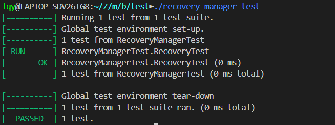

# Part 6: Recovery Manager

小组成员：李秋宇 杨培源 吴欣玥

本部分负责人：李秋宇

[TOC]

---

## 基本信息

本部分主要实现一个故障恢复系统，为独立于大模块之外的一个单独的模块，实验设计为了避免模块间耦合度过高于是将其独立，只需要在本模块中完成对内存型数据库的故障恢复即可

---

## 模块源代码

* `src/include/recovery/log_rec.h`
* `src/include/recovery/recovery_manager.h`

---

## 模块功能实现

### `log_rec.h`

在这个模块中，定义了日志记录的基本结构

首先根据日志记录的类型建立了枚举类`LogRecType`，分别用来表征不同的日志类型，后续会用到

然后要完成结构体`LogRec`相关方法的实现

#### 结构体相关

因为日志需要记录一个事务的一个操作前与后的状态，所以在结构体内额外定义了四个变量：

```cpp
struct LogRec {
    ...
   /**
    * The <key, value> pairs
    * For `insert`, the <new_key, new_val> pair is used.
    * For `delete`, the <old_key, old_val> pair is used.
    * For `update`, the <old_key, old_val> pair is used for the old record, and the <new_key, new_val> pair is used for the new record.
    */
    KeyType old_key_;
    ValType old_Val_;
    KeyType new_key_;
    ValType new_val_;
    ...
}
```

用四个变量来完成后续的标记

此外，还实现了一个`GetAndUpdatePrevLSN`方法，用处如函数名所示

> 前一个`lsn`的作用是故障恢复的undo阶段能够利用这样的链表顺序回滚

因为后续要实现的6个方法其实只要根据不同的日志记录类型做对应的操作即可，有很大一份代码重用的空间，即得到前一个`lsn`这个过程，因此在这里专门实现一个私有方法

实现也比较容易，就是利用`prev_lsn_map`这个字典去找对应的事务的前一个`lsn`是否存在，如果存在就设为这个`lsn`，否则返回不存在，并且记录下当前`lsn`对应的事务，保存在这个字典中

```cpp
/**
 * Get the previous lsn of the transaction from the map and update it with the current lsn. If not found, insert a new entry.
 * @param txn_id The transaction id.
 * @param cur_lsn The current lsn of the transaction.
 * @return The previous lsn of the transaction.
 * @note If the previous lsn is not found, it will be set to INVALID_LSN.
 */
static lsn_t GetAndUpdatePrevLSN(txn_id_t txn_id, lsn_t cur_lsn) {
    lsn_t prev_lsn;
    prev_lsn = (prev_lsn_map_.count(txn_id)? prev_lsn_map_[txn_id] : INVALID_LSN);
    prev_lsn_map_[txn_id] = cur_lsn;
    return prev_lsn;
}
```

#### `Insert`方法

插入一条`Insert`类型的日志记录，从枚举类中设为`kInsert`，然后把插入的键值对分别用`new_key_`和`new_val_`记录下来

```cpp
/**
 * Create a new insert log record.
 * @param txn_id The transaction id.
 * @param ins_key The key of the inserted record.
 * @param ins_val The value of the inserted record.
 * @return A shared pointer to the log record.
 */
static LogRecPtr CreateInsertLog(txn_id_t txn_id, KeyType ins_key, ValType ins_val) {
  lsn_t lsn = LogRec::next_lsn_++;
  LogRecPtr log = std::make_shared<LogRec>(LogRecType::kInsert, lsn, txn_id, LogRec::GetAndUpdatePrevLSN(txn_id, lsn));
  log->new_key_ = std::move(ins_key);
  log->new_val_ = ins_val;
  return log;
}
```

#### `Delete`方法

同理，只要把日志类型设为`kDelete`然后完成相关操作

```cpp
/**
 * Create a new delete log record.
 * @param txn_id The transaction id.
 * @param del_key The key of the deleted record.
 * @param del_val The value of the deleted record.
 * @return A shared pointer to the log record.
 */
static LogRecPtr CreateDeleteLog(txn_id_t txn_id, KeyType del_key, ValType del_val) {
  lsn_t lsn = LogRec::next_lsn_++;
  LogRecPtr log = std::make_shared<LogRec>(LogRecType::kDelete, lsn, txn_id, LogRec::GetAndUpdatePrevLSN(txn_id, lsn));
  log->old_key_ = std::move(del_key);
  log->old_val_ = del_val;
  return log;
}
```

#### `Update`方法

这里用到了前面说的结构体内定义的4个变量，全部使用，记下更新前后的键值对，其它操作同上

```cpp
/**
 * Create a new update log record.
 * @param txn_id The transaction id.
 * @param old_key The key of the old record.
 * @param old_val The value of the old record.
 * @param new_key The key of the new record.
 * @param new_val The value of the new record.
 * @return A shared pointer to the log record.
 */
static LogRecPtr CreateUpdateLog(txn_id_t txn_id, KeyType old_key, ValType old_val, KeyType new_key, ValType new_val) {
  lsn_t lsn = LogRec::next_lsn_++;
  LogRecPtr log = std::make_shared<LogRec>(LogRecType::kUpdate, lsn, txn_id, LogRec::GetAndUpdatePrevLSN(txn_id, lsn));
  log->old_key_ = std::move(old_key);
  log->old_val_ = old_val;
  log->new_key_ = std::move(new_key);
  log->new_val_ = new_val;
  return log;
}
```

#### `Begin`方法

这里比较简单，因为日志只需要记录事务开始了，并没有别的操作

```cpp
/**
 * Create a new begin log record.
 * @param txn_id The transaction id.
 * @return A shared pointer to the log record.
 */
static LogRecPtr CreateBeginLog(txn_id_t txn_id) {
  lsn_t lsn = LogRec::next_lsn_++;
  return std::make_shared<LogRec>(LogRecType::kBegin, lsn, txn_id, LogRec::GetAndUpdatePrevLSN(txn_id, lsn));
}
```

#### `Commit`方法

同上

```cpp
/**
 * Create a new commit log record.
 * @param txn_id The transaction id.
 * @return A shared pointer to the log record.
 */
static LogRecPtr CreateCommitLog(txn_id_t txn_id) {
  lsn_t lsn = LogRec::next_lsn_++;
  return std::make_shared<LogRec>(LogRecType::kCommit, lsn, txn_id, LogRec::GetAndUpdatePrevLSN(txn_id, lsn));
}
```

#### `Abort`方法

同上

```cpp
/**
 * Create a new abort log record.
 * @param txn_id The transaction id.
 * @return A shared pointer to the log record.
 */
static LogRecPtr CreateAbortLog(txn_id_t txn_id) {
  lsn_t lsn = LogRec::next_lsn_++;
  return std::make_shared<LogRec>(LogRecType::kAbort, lsn, txn_id, LogRec::GetAndUpdatePrevLSN(txn_id, lsn));
}
```

至此，这部分的方法实现完成

### `recovery_manager.h`

这一部分使用前一部分已经实现好的所有功能和方法，直接调用即可

`KvDatabase`是模拟的内存数据库，`ATT`是活跃事务表，用于检查点用

检查点`CheckPoint`已经完全实现，只需要实现`RecoveryManager`中的方法即可

#### `Init`方法

`Init`方法用于初始化一个故障恢复系统，以最近的一个检查点为输入对象，记录下已经完成数据持久化的最后一个序列号`lsn`，同时得到已持久化的数据，保留活跃事务表

```cpp
/**
 * Initialize the recovery manager with the last checkpoint.
 * @param last_checkpoint the last checkpoint
 */
void Init(CheckPoint &last_checkpoint) {
    persist_lsn_ = last_checkpoint.checkpoint_lsn_;
    active_txns_ = last_checkpoint.active_txns_;
    data_ = last_checkpoint.persist_data_;
    return ;
}
```

#### `Redo`方法

在redo阶段，进行判断，如果日志序列号大于已持久化的序列号，则表明这个事务需要进行重做

这里遍历当前检查点中所有的日志记录并判断

首先实现对单个日志记录的重做`Redo`，函数传参为一个日志记录对象，对日志对象进行判断：

* 如果是插入，则重新插入一次
* 如果是删除，则重新删除一次
* 如果是更新，则重新更新一次
* 如果是终止，则需要回滚
* 如果是已提交，那么只需要从活跃事务列表中去除这一项即可
* 其它日志记录类型，不用任何操作

然后遍历整个检查点钟的日志记录，对每一条执行判断即可

基于此，实现如下：

```cpp
  /**
   * Redo a single log record depended on its type.
   * @param log_rec the log record to redo.
   */
  void Redo(LogRecPtr log_rec) {
    switch (log_rec->type_) {
      case LogRecType::kInsert: // Redo insert.
        data_[log_rec->new_key_] = log_rec->new_val_;
        break;
      case LogRecType::kDelete: // Redo delete.
        data_.erase(log_rec->old_key_);
        break;
      case LogRecType::kUpdate: // Redo update.
        data_.erase(log_rec->old_key_);
        data_[log_rec->new_key_] = log_rec->new_val_;
        break;
      case LogRecType::kAbort: // The transaction is aborted, need to rollback.
        Rollback(log_rec->txn_id_);
        [[fallthrough]];
      case LogRecType::kCommit: // Already commited log record, remove from active transactions.
        active_txns_.erase(log_rec->txn_id_);
        break;
      default: // Nothing to do with other log record types.
        break;
    }
    return ; 
  }

  /**
   * Redo all the log records that are after the last checkpoint.
   */
  void RedoPhase() {
    for (const auto& log: log_recs_) {
      if (log.first < persist_lsn_) continue; // Already persisted data, skip.
      // Find the 1st log record that is after persist_lsn_, need to redo.
      active_txns_[log.second->txn_id_] = log.second->lsn_; // Add active transaction.
      Redo(log.second);
    }
  }
```

回滚方法在下面即将介绍

#### `Undo`方法

同样道理，只需要对活跃事务进行回滚操作即可

回滚类似于重做的逆向顺序，执行相反的操作

* 如果是插入记录，那么删除插入的数据
* 如果是删除记录，那么重新插入数据
* 如果是更新，那么恢复数据

实现如下：

```cpp
  /**
   * Rollback a single transaction.
   * @param txn_id the transaction to rollback.
   */
  void Rollback(txn_id_t txn_id) {
    lsn_t last_log_lsn = active_txns_[txn_id]; // Get the last log record of the active transaction.
    while (last_log_lsn != INVALID_LSN) {
      LogRecPtr log_rec = log_recs_[last_log_lsn];
      if (log_rec == nullptr) break;
      // Undo the log record.
      switch (log_rec->type_) {
        case LogRecType::kInsert: // Undo insert, erase the inserted key-value pair.
          data_.erase(log_rec->new_key_);
          break;
        case LogRecType::kDelete: // Undo delete, insert the deleted key-value pair.
          data_[log_rec->old_key_] = log_rec->old_val_;
          break;
        case LogRecType::kUpdate: // Undo update, insert the old key-value pair and erase the new key-value pair.
          data_.erase(log_rec->new_key_);
          data_[log_rec->old_key_] = log_rec->old_val_;
          break;
        default:
          break;
      }
      last_log_lsn = log_rec->prev_lsn_; // Undo the next.
    }
    return ;
  }

  /**
   * Undo all the active transactions that are after the last checkpoint.
   */
  void UndoPhase() {
    for (const auto& atts : active_txns_) {
      Rollback(atts.first);
    }
    active_txns_.clear(); // Undo completed.
  }
```

---

## 模块功能测试

运行测试，跑通测试



---

## 性能调优

这里对模块实现做了一些性能调优

### 移动构造

在`log_rec.h`中实现了移动构造，如[Insert方法](#insert方法)，使用`std::move`进行移动构造，把插入的值进行移动构造到`new_key_`中，实现性能提升（虽然提升不大）

### 代码重用

上文已经提及，对于大体逻辑相似的部分提取出专门一个函数，这样不同的类型只需要调用即可

### switch-case语句穿透

这里只是为了简单写代码，使用switch-case语句时使用了`[[fallthrough]]`来完成，主要是有一些地方可以共用，节省代码撰写量

如[Redo方法](#redo方法)中使用

---

## 总结

这个部分的难度不大，只需要了解数据库系统关于故障恢复的相关概念即可完成，内容也不是很多

### 思考题

> 模块中，为了简化实验难度，我们将Recovery Manager模块独立出来。如果不独立出来，真正做到数据库在任何时候断电都能恢复，同时支持事务的回滚，Recovery Manager应该怎样设计呢？此外，CheckPoint机制应该怎样设计呢？

如果要把这个模块与前面所有工作进行耦合，那么需要首先对检查点机制进行改写，这个`CheckPoint`可以拉出来作为**一个单独的类或模块**重新实现，并且要求它能够**有一个独立的进程**，当数据库启动的时候就跟随启动，每隔一段时间就对整个数据库当前状态进行扫描，获取活跃事务表、已持久化数据和事务信息等等，然后如果发生故障时，它从一个扫描的状态退出，然后向`RecoveryManager`发送信息，开始故障恢复

对于`Recovery Manager`来说，它肯定需要重新改写了，因为前面实现的是简化版的，只用了一个`std::unorder_map`来模拟内存数据库，实际上我们要把这个替换为大的数据库，涉及的方面就很多了，要和前面的如index、buffer模块耦合，完成对数据的恢复，属于是一个扩展了故障恢复系统的业务
