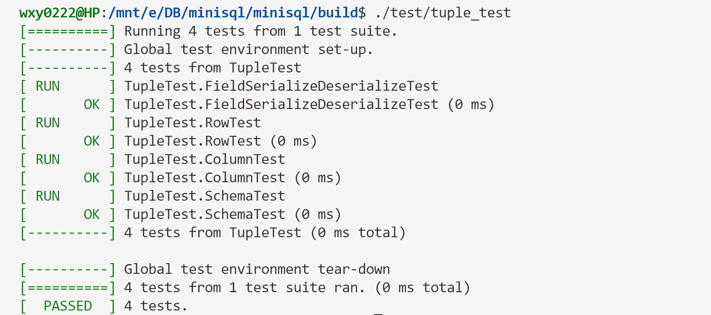
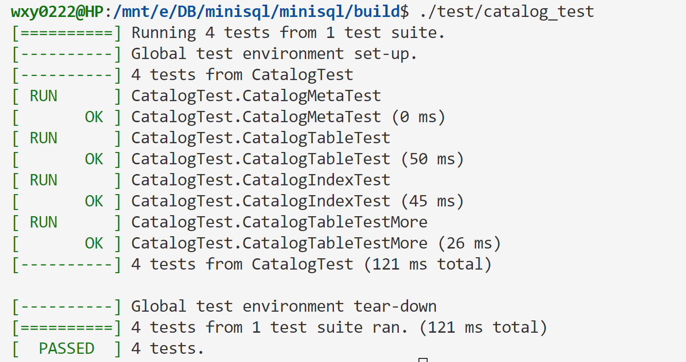

# 数据库个人报告
</br>

3220106028 吴歆玥
Date : 2024-06-17
</br>

## 一、个人实现模块
 - Part 2 : Record Manager
 - Part 4 : CATALOG MANAGER

## 二、模块具体说明
### 2.1 Record Manager
 - 在MiniSQL的设计中，Record Manager负责管理数据表中所有的记录，它能够⽀持记录的插⼊、删除与查找操作，并对外提供相应的接口。
 - 该部分主要分为两个模块：记录的插⼊、删除与查找操作及相应接口的实现、堆表相关操作的实现
 </br>
#### 2.1.1 记录与模式
 - 与记录（`Record`）相关的概念有以下⼏个：
    - 列（`Column`）：在`src/include/record/column.h`中被定义，⽤于定义和表示数据表中的某⼀个字段，即包含了这个字段的字段名、字段类型、是否唯⼀等等；
    - 模式（`Schema`）：在`src/include/record/schema.h`中被定义，⽤于表示⼀个数据表或是⼀个索引的结构。⼀个`Schema`由⼀个或多个的`Column`构成；
    - 域（`Field`）：在`src/include/record/field.h`中被定义，它对应于⼀条记录中某⼀个字段的数据信息，如存储数据的数据类型，是否是空，存储数据的值等等；
    - ⾏（`Row`）：在`src/include/record/row.h`中被定义，与元组的概念等价，⽤于存储记录或索引键，⼀个`Row`由⼀个或多个`Field`构成。
 - 为了能够持久化存储上述对象，我们需要提供一种能将这些对象序列化成字节流的方法，以写入数据页中。同时，为了能从磁盘中恢复这些对象，我们同样需要提供一种反序列化的方法把字符流读取到对象中。
 - 基于已有实现代码，我对Row, Column, Schema增加了序列化与反序列化方法。下面是具体实现：
</br>

##### Row
 - `Row::SerializeTo(char *buf, Schema *schema)`
    - 函数功能：将Row对象序列化成字节流，返回字节流的长度
    - 函数参数：
        - `char *buf`：字节流缓冲区
        - `Schema *schema`：记录的模式
        - `返回值`：字节流的长度
    - 函数实现：
        - 首先检查传入的Schema对象是否为空以及Schema的列数是否与Row对象的字段数相等。接着将字段数序列化到字节流中，并根据字段数计算并创建一个空位图，用于表示每个字段是否为空，接着序列化空位图，为每个非空字段调用其SerializeTo方法将字段数据序列化到字节流中。最后，返回offset，表示已序列化的数据的长度。
```cpp
/**
 *  Row format:
 * -------------------------------------------
 * | Header | Field-1 | ... | Field-N |
 * -------------------------------------------
 *  Header format:
 * --------------------------------------------
 * | Field Nums | Null bitmap |
 * -------------------------------------------
 */
uint32_t Row::SerializeTo(char *buf, Schema *schema) const {
  ASSERT(schema != nullptr, "Invalid schema before serialize.");
  ASSERT(schema->GetColumnCount() == fields_.size(), "Fields size do not match schema's column size.");
  uint32_t offset = 0;
  // Field Nums
  uint32_t fieldNums = GetFieldCount();
  memcpy(buf, &fieldNums, sizeof(uint32_t));  //field Nums
  offset += sizeof(uint32_t);
  if(fieldNums == 0) return offset;

  // 用Null Bitmap标记
  int null_bitmap_size = (fieldNums + 7) / 8;
  char *null_bitmap = new char[null_bitmap_size];
  memset(null_bitmap, 0, null_bitmap_size);
  int index = 0;
  for(auto it = fields_.begin(); it != fields_.end(); it++,index++) {
    if(!((*it)->IsNull())) {
      null_bitmap[index / 8] |= 1 << (7 - (index % 8)); // 从char[0]开始，从高位至低位
    }
  }
  memcpy(buf + offset, null_bitmap, null_bitmap_size*sizeof(char)); // 序列化null bitmap
  offset += null_bitmap_size*sizeof(char);

  delete []null_bitmap;
  for(auto it = fields_.begin(); it != fields_.end(); it++) {
    if(!((*it)->IsNull())) {
      int ofs = (*it)->SerializeTo(buf + offset);
      offset += ofs;
    }
  }
  return offset;
}
```

 - `Row::DeserializeFrom(char *buf, Schema *schema)`
    - 函数功能: 从字节流中反序列化出Row对象，返回反序列化后的字节流的长度
    - 函数参数：
        - `char *buf`：字节流缓冲区
        - `Schema *schema`：记录的模式
        - 返回值：反序列化后的字节流的长度
    - 函数实现：
        - 首先，函数对传入的参数进行合法性检查，确保schema不为空，且fields_为空。然后，函数从buf中读取第一个uint32_t值，表示字段的数量，并更新offset。如果字段数量为0，则直接返回当前的offset。继续根据字段数量计算出null bitmap的大小，并在buf中读取对应大小的字节序列到null_bitmap中，更新offset。对于每个字段，函数从schema中获取对应字段的类型，并根据null bitmap判断该字段是否为NULL。如果字段不为NULL，则根据字段的类型从buf中读取对应的字节序列，并创建一个Field对象，将其添加到fields_中。最后，返回offset。
```cpp
uint32_t Row::DeserializeFrom(char *buf, Schema *schema) {
  ASSERT(schema != nullptr, "Invalid schema before serialize.");
  ASSERT(fields_.empty(), "Non empty field in row.");
  uint32_t offset = 0;
  TypeId type = TypeId::kTypeInvalid;
  
  uint32_t fieldNums = 0;
  memcpy(&fieldNums, buf, sizeof(uint32_t));
  offset += sizeof(uint32_t);
  if(fieldNums == 0) return offset;

  uint32_t null_bitmap_size = (fieldNums + 7) / 8;
  char *null_bitmap = new char[null_bitmap_size];
  memcpy(null_bitmap, buf + offset, null_bitmap_size*sizeof(char));
  offset += null_bitmap_size*sizeof(char);
  for(int i = 0; i < fieldNums; i++){
    type = schema->GetColumn(i)->GetType();
    Field *f = nullptr;
    if(null_bitmap[i / 8] & (1 << (7 - (i % 8)))) {
      if(type == TypeId::kTypeInvalid){
        
      }else if(type == TypeId::kTypeInt){
        int32_t integer_ = 0;
        memcpy(&integer_, buf + offset, sizeof(int32_t));
        offset += sizeof(int32_t);
        f = new Field(type, integer_);
      }else if(type == TypeId::kTypeFloat){
        float float_ = 0;
        memcpy(&float_, buf + offset, sizeof(float));
        offset += sizeof(float);
        f = new Field(type, float_);
      }else{
        uint32_t len_ = 0;
        memcpy(&len_, buf + offset, sizeof(uint32_t));
        offset += sizeof(uint32_t);
        char *data_ = new char[len_];
        memcpy(data_, buf + offset, len_);
        offset += len_;
        f = new Field(type, data_, len_, true);
      }
    }
    fields_.push_back(f);
  }
  return offset;
}
```

 - `Row::GetSerializedSize(Schema *schema)`
    - 函数功能：计算Row对象在字节流中的长度
    - 函数参数：
        - `Schema *schema`：记录的模式
        - 返回值：字节流的长度
    - 函数实现：
        - 首先检查Schema是否为空以及字段数量是否与Schema的列数匹配。然后根据字段数量计算null bitmap的大小。遍历字段列表，如果字段不为空，则累加其序列化后的大小。最后返回Row的总大小，包括字段大小、null bitmap大小和uint32_t类型的大小。
```cpp
uint32_t Row::GetSerializedSize(Schema *schema) const {
  ASSERT(schema != nullptr, "Invalid schema before serialize.");
  ASSERT(schema->GetColumnCount() == fields_.size(), "Fields size do not match schema's column size.");
  if(schema->GetColumnCount() == 0) return 0;
  if(fields_.empty()) return 0;
  uint32_t fileNums = GetFieldCount();
  uint32_t null_bitmap_size = (fileNums + 7) / 8;
  uint32_t size = 0;
  for(auto it = fields_.begin(); it != fields_.end(); it++) {
    if(!((*it)->IsNull())) {
      size += (*it)->GetSerializedSize();
    }
  }
  return size + sizeof(uint32_t) + null_bitmap_size*sizeof(char);
}
```

##### Column
 - `Column::SerializeTo(char *buf)`
    - 函数功能：将Column对象序列化到字节流中
    - 函数参数：
        - `char *buf`：字节流缓冲区
        - 返回值：序列化后的字节流的长度
    - 函数实现：
        - 首先将一个固定的`COLUMN_MAGIC_NUM`写入到buf中，然后按照顺序将列名的长度、列名、列类型、列长度、所属表的索引、是否可为空以及是否唯一的标志位写入到buf中。最后返回写入buf的总字节数。
```cpp
uint32_t Column::SerializeTo(char *buf) const {
  uint32_t offset = 0;
  memcpy(buf + offset, &COLUMN_MAGIC_NUM, sizeof(uint32_t));
  offset += sizeof(uint32_t);
  uint32_t name_len = name_.size();
  memcpy(buf + offset, &name_len, sizeof(uint32_t));
  offset += sizeof(uint32_t);
  const char *name_buf = name_.c_str();
  memcpy(buf + offset, name_buf, name_len);
  offset += name_len;
  memcpy(buf + offset, &type_, sizeof(TypeId));
  offset += sizeof(TypeId);
  memcpy(buf + offset, &len_, sizeof(uint32_t));
  offset += sizeof(uint32_t);
  memcpy(buf + offset, &table_ind_, sizeof(uint32_t));
  offset += sizeof(uint32_t);
  memcpy(buf + offset, &nullable_, sizeof(bool));
  offset += sizeof(bool);
  memcpy(buf + offset, &unique_, sizeof(bool));
  offset += sizeof(bool);
  return offset;
}
```

 - `Column::GetSerializedSize()`
    - 函数功能：计算Column对象在字节流中的长度
    - 函数参数：
        - 返回值：长度
    - 函数实现：
        - 根据列对象的成员变量，累加计算序列化后所需的空间大小。
```cpp
uint32_t Column::GetSerializedSize() const {
  uint32_t size = 0;
  size += 4*sizeof(uint32_t) + sizeof(TypeId) + 2*sizeof(bool) + name_.size();
  return size;
}
```

 - `Column::DeserializeFrom(char *buf, Column *&column)`
    - 函数功能：从字节流中反序列化Column对象
    - 函数参数：
        - `char *buf`：字节流缓冲区
        - `Column *&column`：反序列化后的Column对象
        - 返回值：反序列化后的字节流的长度
    - 函数实现：
        - 首先从缓冲区中拷贝出magic_num，并与COLUMN_MAGIC_NUM进行比较，如果不相等，则输出错误日志。从缓冲区中拷贝出name的长度nameSize，然后根据nameSize动态分配一个字符数组name_buf，并将name拷贝到name_buf中，最后构造一个std::string对象name。接着从缓冲区中依次拷贝出type、len、table_ind、nullable和unique。根据type的值决定是创建一个Column对象还是创建一个CharColumn对象，并将name、type、len（如果type是kTypeChar）、table_ind、nullable和unique作为参数传入构造函数。最后返回offset。
```cpp
uint32_t Column::DeserializeFrom(char *buf, Column *&column) {
  uint32_t magic_num;
  TypeId type;
  uint32_t len;
  uint32_t table_ind;
  bool nullable;
  bool unique;
  uint32_t offset = 0;
  memcpy(&magic_num, buf, sizeof(uint32_t));
  if (magic_num != COLUMN_MAGIC_NUM) {
    LOG(ERROR) << "Wrong magic number." << std::endl;
  }
  offset += sizeof(uint32_t);
  uint32_t nameSize = 0;
  memcpy(&nameSize, buf + offset, sizeof(uint32_t));
  char * name_buf = new char[nameSize + 1];
  offset += sizeof(uint32_t);
  memcpy(name_buf, buf + offset, nameSize);
  name_buf[nameSize] = '\0';
  std::string name = std::string(name_buf);
  delete[] name_buf;
  offset += nameSize;
  memcpy(&type, buf + offset, sizeof(TypeId));
  offset += sizeof(TypeId);
  memcpy(&len, buf + offset, sizeof(uint32_t));
  offset += sizeof(uint32_t);
  memcpy(&table_ind, buf + offset, sizeof(uint32_t));
  offset += sizeof(uint32_t);
  memcpy(&nullable, buf + offset, sizeof(bool));
  offset += sizeof(bool);
  memcpy(&unique, buf + offset, sizeof(bool));
  offset += sizeof(bool);
  if(type == TypeId::kTypeChar) {
    column = new Column(name, type, len, table_ind, nullable, unique);
  } else {
    column = new Column(name, type, table_ind, nullable, unique);
  }
  return offset;
}
```

##### Schema
 - `Schema::SerializeTo(char *buf)`
    - 函数功能：将Schema对象序列化到字节流中
    - 函数参数：
        - `char *buf`：字节流缓冲区
        - 返回值：序列化后的字节流的长度
    - 函数实现：
        - 首先将一个魔数（SCHEMA_MAGIC_NUM）和列的数量写入到缓冲区中，然后遍历所有列，将每一列序列化到缓冲区中，并更新offset，最后返回offset。
```cpp
uint32_t Schema::SerializeTo(char *buf) const {
  uint32_t offset = 0;
  memcpy(buf + offset, &SCHEMA_MAGIC_NUM, sizeof(uint32_t));
  offset += sizeof(uint32_t);
  uint32_t column_count=GetColumnCount();
  memcpy(buf + offset, &column_count, sizeof(uint32_t));
  offset += sizeof(uint32_t);
  for(int i=0;i<(int)column_count;i++){
    int d=columns_[i]->SerializeTo(buf+offset);
    offset+=d;
  }
  return offset;
}
```

 - `Schema::GetSerializedSize()`
    - 函数功能：计算Schema对象在字节流中的长度
    - 函数参数：
        - 返回值：长度
    - 函数实现：
        - 根据Schema对象的成员变量，累加计算序列化后所需的空间大小。
```cpp
uint32_t Schema::GetSerializedSize() const {
  uint32_t size=0;
  size+=2*sizeof(uint32_t);
  for(int i=0;i<(int)columns_.size();i++){
    size+=columns_[i]->GetSerializedSize();
  }
  return size;
}
```

 - `Schema::DeserializeFrom(char *buf, Schema *&schema)`
    - 函数功能：从字节流中反序列化Schema对象
    - 函数参数：
        - `char *buf`：字节流缓冲区
        - `Schema *&schema`：反序列化后的Schema对象
        - 返回值：反序列化后的字节流的长度
    - 函数实现：
        - 首先读取缓冲区中的魔数以验证数据的正确性，然后读取列数，并依次反序列化每一列，将其存储在一个临时向量中。最后，通过构造函数创建一个新的Schema对象，并返回读取的总偏移量。
```cpp
uint32_t Schema::DeserializeFrom(char *buf, Schema *&schema) {
  uint32_t offset=0;
  uint32_t magic;
  memcpy(&magic,buf+offset,sizeof(magic));
  offset+=sizeof(magic);
  if (magic != SCHEMA_MAGIC_NUM) {
    LOG(ERROR) << "Wrong magic number." << std::endl;
  }
  uint32_t column_count;
  memcpy(&column_count,buf+offset,sizeof(column_count));
  offset+=sizeof(column_count);
  std::vector<Column*> tmp;
  tmp.reserve(column_count);//reduce allocation time
  for(int i=0;i<(int)column_count;i++){
    Column *p;
    offset+=Column::DeserializeFrom(buf+offset,p);
    tmp.push_back(p);
  }
  schema=new Schema(tmp,true);
  return offset;
}
```
</br>

#### 2.1.2 通过堆表管理记录
- `RowId`: 对于数据表中的每一行记录，都有⼀个唯⼀标识符`RowId`与之对应。`RowId`同时具有逻辑和物理意义，在物理意义上，它是⼀个64位整数，是每行记录的唯⼀标识；而在逻辑意义上，它的高32位存储的是该`RowId`对应记录所在数据页的`page_id`，低32位存储的是该`RowId`在`page_id`对应的数据页中对应的是第几条记录。
- `TableHeap`: 堆表是⼀种将记录以无序堆的形式进行组织的数据结构。不同的数据页（`TablePage`）之间通过双向链表连接。堆表中的记录通过`RowId`进行定位。`RowId`记录了该行记录所在的`page_id`和`slot_num`，其中`slot_num`用于定位记录在这个数据页中的下标位置。
- 堆表管理记录主要涉及以下功能：
    - : InsertTuple
    - : DeleteTuple
    - : UpdateTuple
    - : GetTuple
    ...
- 下面是具体实现：
##### TableHeap
 - `TableHeap::InsertTuple(Row &row, Txn *txn)`
    - 函数功能：向堆表中插入一条记录
    - 函数参数：
        - `Row &row`：待插入的记录
        - `Txn *txn`：事务指针
        - 返回值: true or false
    - 函数实现：
        - 遍历表的页面，寻找空间插入数据。若当前页面满，则会创建新页面。如果数据太大以至于单个页面无法容纳，或页面分配失败，则操作失败返回false。成功插入后，返回true。
```cpp
bool TableHeap::InsertTuple(Row &row, Txn *txn) {
  if(row.GetSerializedSize(this->schema_) >= PAGE_SIZE) return false;
  page_id_t current_page_id = first_page_id_;
  TablePage *current_page;
  while(true){
    current_page = reinterpret_cast<TablePage *>(buffer_pool_manager_->FetchPage(current_page_id));
    if(!current_page) return false;
    if(current_page->GetTupleCount()==0&&current_page->GetNextPageId()==0){
      current_page->Init(current_page_id, INVALID_PAGE_ID, log_manager_, txn);
    }
    if(current_page->InsertTuple(row, schema_, txn, lock_manager_, log_manager_)){
      buffer_pool_manager_->UnpinPage(current_page_id, true);
      return true;
    }
    page_id_t next_page_id = current_page->GetNextPageId();
    if(next_page_id == INVALID_PAGE_ID){
      page_id_t new_page_id;
      auto new_page = reinterpret_cast<TablePage *>(buffer_pool_manager_->NewPage(new_page_id));
      if(new_page_id==current_page_id){
        LOG(ERROR)<<"new page allocate error!";
      }
      if (!new_page) return false;
      new_page->Init(new_page_id, current_page_id, log_manager_, txn);
      new_page->SetNextPageId(INVALID_PAGE_ID); 
      current_page->SetNextPageId(new_page_id);
      buffer_pool_manager_->UnpinPage(current_page_id, true); 
      current_page_id = new_page_id; 
      continue;
    }
    buffer_pool_manager_->UnpinPage(current_page_id, false);
    current_page_id = next_page_id;
  }
  return false; 
}
```

 - `TableHeap::UpdateTuple(const Row &row, const RowId &rid, Txn *txn)`
    - 函数功能：更新堆表中指定记录
    - 函数参数：
        - `const Row &row`：待更新的记录
        - `const RowId &rid`：待更新的记录的`RowId`
        - `Txn *txn`：事务指针
        - 返回值：true or false
    - 函数实现：
        - 首先检查要更新的元组大小是否超过页面大小，如果超过则返回false。然后获取元组所在页面的ID，并从buffer_pool_manager_中获取该页面。如果页面为空，则返回false。接着对页面加写锁，并创建一个新的Row对象用于存储旧的元组。如果调用page的UpdateTuple方法成功，则将页面设置为已提交状态，释放旧的元组对象和写锁，并返回true。如果更新失败，则将页面设置为未提交状态，释放旧的元组对象和写锁，并返回false。
```cpp
bool TableHeap::UpdateTuple(const Row &row, const RowId &rid, Txn *txn) { 
  if(row.GetSerializedSize(this->schema_) >= PAGE_SIZE) {
    LOG(ERROR)<<"UpdateTuple: tuple size is too large";
    return false;
  }
  page_id_t current_page_id = rid.GetPageId(); // 找到元组所在页的Id
  auto page = reinterpret_cast<TablePage *>(buffer_pool_manager_->FetchPage(current_page_id));
  if(page == nullptr) {
    LOG(ERROR)<<"UpdateTuple: page is nullptr";
    return false;
  }
  page->WLatch(); // 写锁
  Row *old_row = new Row(rid);
  if(page->UpdateTuple(row, old_row, schema_, txn, lock_manager_, log_manager_)){
    buffer_pool_manager_->UnpinPage(page->GetTablePageId(), true);
    delete old_row;
    page->WUnlatch();
    return true;
  }
  buffer_pool_manager_->UnpinPage(page->GetTablePageId(), false);
  delete old_row;
  page->WUnlatch(); // 释放
  return false; 
}
```

 - `TableHeap::ApplyDelete(const RowId &rid, Txn *txn)`
    - 函数功能：将指定的行从堆表中删除
    - 函数参数：
        - `const RowId &rid`：待删除记录的`RowId`
        - `Txn *txn`：事务指针
        - 返回值：无
    - 函数实现：
        - 先找到行所在的页面，加锁后执行删除操作，最后解锁并释放页面。
```cpp
void TableHeap::ApplyDelete(const RowId &rid, Txn *txn) {
  // Step1: Find the page which contains the tuple.
  // Step2: Delete the tuple from the page.
  page_id_t current_page_id = rid.GetPageId();
  TablePage *page = reinterpret_cast<TablePage *>(buffer_pool_manager_->FetchPage(current_page_id));
  if(page == nullptr) {
    LOG(ERROR)<<"ApplyDelete: page is nullptr";
    return;
  }
  page->WLatch();
  page->ApplyDelete(rid, txn, log_manager_);
  page->WUnlatch();
  buffer_pool_manager_->UnpinPage(page->GetTablePageId(), true);
}
```

 - `TableHeap::GetTuple(Row *row, Txn *txn)`
    - 函数功能：根据`RowId`获取元组
    - 函数参数：
        - `Row *row`：待获取记录的`RowId`
        - `Txn *txn`：事务指针
        - 返回值：true or false
    - 函数实现：
        - 从TableHeap对象的buffer_pool_manager_中获取指定RowId所在的page，并对page加读锁。然后尝试从page中获取Row对象，如果成功则释放读锁并返回true，否则释放读锁并返回false。
```cpp
bool TableHeap::GetTuple(Row *row, Txn *txn) { 
  RowId rid = row->GetRowId();
  page_id_t current_page_id = rid.GetPageId();
  TablePage *page = reinterpret_cast<TablePage *>(buffer_pool_manager_->FetchPage(current_page_id));
  if(page == nullptr) {
    LOG(ERROR)<<"GetTuple: page is nullptr";
    return false;
  }
  page->RLatch(); 
  if(page->GetTuple(row, schema_, txn, lock_manager_)){
    buffer_pool_manager_->UnpinPage(page->GetTablePageId(), false); 
    page->RUnlatch();
    return true;
  }
  buffer_pool_manager_->UnpinPage(page->GetTablePageId(), false); 
  page->RUnlatch(); 
  return false; 
}
```
</br>

##### TableIterator
 - `TableHeap::Begin(Txn *txn)`
    - 函数功能：返回一个迭代器，指向TableHeap的第一个元组
    - 函数实现：
        - 它遍历表的页面，寻找第一个元组所在的页面和行ID，然后返回一个迭代器指向该位置
```cpp
TableIterator TableHeap::Begin(Txn *txn) { 
  page_id_t begin_page_id = first_page_id_;
  RowId begin_page_rid_;
  while(begin_page_id != INVALID_PAGE_ID){ 
    TablePage *begin_page = reinterpret_cast<TablePage *>(buffer_pool_manager_->FetchPage(begin_page_id));
    if(begin_page == nullptr) {
      begin_page_id = begin_page->GetNextPageId();
      continue;
    }
    if(begin_page->GetFirstTupleRid(&begin_page_rid_)){
      buffer_pool_manager_->UnpinPage(begin_page_id, false);
      return TableIterator(this, begin_page_rid_, txn);
    } 
    buffer_pool_manager_->UnpinPage(begin_page_id, false);
    begin_page_id = begin_page->GetNextPageId();
  }
  return TableIterator(this, RowId(), txn); 
}
```
 - `TableHeap::End()`
    - 函数功能：返回一个TableIterator类型的对象，表示表的结束位置的迭代器
    - 函数实现：
        - 此函数用于返回一个表示表末尾的迭代器。若表为空，则直接返回空迭代器；否则，遍历表的所有页面直到最后一页，最终返回指向表末尾的迭代器实例。
```cpp
TableIterator TableHeap::End() { 
  if(first_page_id_ == INVALID_PAGE_ID) { // 空表，返回空迭代器
    return TableIterator(nullptr, RowId(INVALID_PAGE_ID, 0), nullptr);
  }
  page_id_t end_page_id = first_page_id_;
  TablePage *last_page = nullptr;
  while (end_page_id != INVALID_PAGE_ID) {
    last_page = reinterpret_cast<TablePage *>(buffer_pool_manager_->FetchPage(end_page_id));
    if (last_page == nullptr) {
      // 如果获取页面失败，这通常是个严重错误一般不会出现，但返回空迭代器
      return TableIterator(nullptr, RowId(INVALID_PAGE_ID, 0), nullptr);
    }
    buffer_pool_manager_->UnpinPage(end_page_id, false);
    end_page_id = last_page->GetNextPageId();
  }
  return TableIterator(this, RowId(INVALID_PAGE_ID, 0), nullptr);
  // return TableIterator(nullptr, RowId(), nullptr); 
}
```

### 2.2 CATALOG MANAGER
- Catalog Manager 负责管理数据库的所有模式信息，包括：
    - a. 数据库中所有表的定义信息，包括表的名称、表中字段（列）数、主键、定义在该表上的索引。
    - b. 表中每个字段的定义信息，包括字段类型、是否唯⼀等。
    - c. 数据库中所有索引的定义，包括所属表、索引建立在那个字段上等。
- Catalog Manager 还必需提供访问及操作上述信息的接口，供执行器使用。
#### 2.2.1 目录、表和索引元信息的持久化
由助教实现，不再赘述
#### 2.2.2 GetSerializedSize()
`CatalogMeta::GetSerializedSize()`
```cpp
uint32_t CatalogMeta::GetSerializedSize() const {
  return (sizeof(uint32_t)*3 + table_meta_pages_.size()*(sizeof(table_id_t) + sizeof(page_id_t)) + index_meta_pages_.size()*(sizeof(index_id_t)+sizeof(page_id_t)));
}
```
`IndexMetadata::GetSerializedSize()`
```cpp
uint32_t IndexMetadata::GetSerializedSize() const {
  return sizeof(uint32_t)*3 + sizeof(index_id_t) + index_name_.length() + sizeof(table_id_t) + sizeof(uint32_t)*key_map_.size();
}
```
`TableMetadata::GetSerializedSize()`
```cpp
uint32_t TableMetadata::GetSerializedSize() const {
  return 4 + 4 + MACH_STR_SERIALIZED_SIZE(table_name_) + 4 + schema_->GetSerializedSize();
}
```
#### 2.2.3 表和索引的管理
 - CatalogManager构造函数
    - 接受`buffer_pool_manager`、`lock_manager`、`log_manager`和`init`作为参数，根据`init`的值决定是初始化`catalog_meta_`还是从磁盘中加载`catalog_meta_`。如果`init`为`true`，则创建一个新的`catalog_meta_`实例；否则，从`buffer_pool_manager_`中获取`CATALOG_META_PAGE_ID`对应的页面数据，反序列化为`catalog_meta_`实例。接下来，根据`catalog_meta_`中的`table_meta_pages_`和`index_meta_pages_`，分别加载表和索引的元数据。
```cpp
CatalogManager::CatalogManager(BufferPoolManager *buffer_pool_manager, LockManager *lock_manager,
                               LogManager *log_manager, bool init)
    : buffer_pool_manager_(buffer_pool_manager), lock_manager_(lock_manager), log_manager_(log_manager) {
      if(init){
        catalog_meta_ = CatalogMeta::NewInstance();
        buffer_pool_manager_->UnpinPage(CATALOG_META_PAGE_ID, false);
      }else{
        catalog_meta_ = CatalogMeta::DeserializeFrom(buffer_pool_manager_->FetchPage(CATALOG_META_PAGE_ID)->GetData());
        buffer_pool_manager->UnpinPage(CATALOG_META_PAGE_ID, false);
        for(auto it : catalog_meta_->table_meta_pages_){
          if(LoadTable(it.first, it.second) != DB_SUCCESS){
            throw std::runtime_error("Failed to load table");
          }
        }
        for(auto it : catalog_meta_->index_meta_pages_){
          if(LoadIndex(it.first, it.second) != DB_SUCCESS){
            throw std::runtime_error("Failed to load index");
          }
        }
        buffer_pool_manager_->UnpinPage(CATALOG_META_PAGE_ID, false);
        FlushCatalogMetaPage();
      }
}
```
 - `CatalogManager::CreateTable(const string &table_name, TableSchema *schema, Txn *txn, TableInfo *&table_info)`
    - 函数功能：创建一个新表
    - 函数实现：
        - 检查表名是否存在，分配表ID和页面，设置表元数据，创建表结构和存储堆，更新内部记录，最后返回成功或失败状态。
```cpp
dberr_t CatalogManager::CreateTable(const string &table_name, TableSchema *schema, Txn *txn, TableInfo *&table_info) {
  if (table_names_.find(table_name) != table_names_.end()) return DB_TABLE_ALREADY_EXIST;
  table_id_t table_id = catalog_meta_->GetNextTableId();
  page_id_t page_id;
  auto page = buffer_pool_manager_->NewPage(page_id);
  if (page == nullptr) return DB_FAILED;
  table_names_[table_name] = table_id;
  catalog_meta_->table_meta_pages_[table_id] = page_id;

  Schema *tmp_schema = Schema::DeepCopySchema(schema);
  auto table_meta = TableMetadata::Create(table_id, table_name, page_id, tmp_schema);
  table_meta->SerializeTo(page->GetData());
  buffer_pool_manager_->UnpinPage(page_id, true);
  auto table_heap = TableHeap::Create(buffer_pool_manager_, tmp_schema, txn, log_manager_, lock_manager_);
  table_info = TableInfo::Create();
  table_info->Init(table_meta, table_heap);
  tables_[table_id] = table_info;

  auto catalog_meta_page = buffer_pool_manager_->FetchPage(CATALOG_META_PAGE_ID);
  catalog_meta_->SerializeTo(catalog_meta_page->GetData());
  buffer_pool_manager_->UnpinPage(CATALOG_META_PAGE_ID, true);
  return DB_SUCCESS;
}
```
 - `GetTable(const string &table_name, TableInfo *&table_info)`
    - 函数功能：根据表名获取表信息
    - 函数实现：
        - 函数通过table_names_成员变量的find方法查找给定表名是否存在于table_names_中。如果表名不存在，则返回DB_TABLE_NOT_EXIST错误码，表示表不存在。如果表名存在，则通过查找到的表名在table_names_中获取对应的表ID。最后返回成功或失败状态。
```cpp
dberr_t CatalogManager::GetTable(const string &table_name, TableInfo *&table_info) {
  if (table_names_.find(table_name) == table_names_.end()) return DB_TABLE_NOT_EXIST;
  table_id_t table_id = table_names_[table_name];
  table_info = tables_[table_id];
  return DB_SUCCESS;
}
```
 - `CatalogManager::GetTable(const table_id_t table_id, TableInfo *&table_info)`
    - 函数功能：根据表ID获取表信息
    - 函数实现：
        - 首先，通过tables_成员变量的find方法，查找指定table_id的表是否存在。如果不存在，返回DB_TABLE_NOT_EXIST表示表不存在。如果表存在，将tables_中存储的对应表信息赋值给table_info指针。最后返回成功或失败状态。
```cpp
dberr_t CatalogManager::GetTable(const table_id_t table_id, TableInfo *&table_info) {
  if(tables_.find(table_id) == tables_.end()) return DB_TABLE_NOT_EXIST;
  table_info = tables_[table_id];
  return DB_SUCCESS;
}
```
 - `CatalogManager::GetTables(vector<TableInfo *> &tables)`
    - 函数功能：获取所有表信息
    - 函数实现：
        - 遍历tables_成员变量，将每个表信息添加到tables中。最后返回成功或失败状态。
```cpp
dberr_t CatalogManager::GetTables(vector<TableInfo *> &tables) const {
  for (auto it : tables_) {
    tables.push_back(it.second);
  }
  return DB_SUCCESS;
}
```
 - `CatalogManager::DropTable(const string &table_name)`
    - 函数功能：删除一个表
    - 函数实现：
        - 首先检查表名是否存在于table_names_中，如果不存在则返回DB_TABLE_NOT_EXIST。接着从table_names_和tables_中删除表名和对应的表信息。随后，检查表元数据页面是否存在于catalog_meta_的table_meta_pages_中，如果是，则从table_meta_pages_中删除表元数据页面并刷新catalog_meta_页面。最后返回DB_SUCCESS表示删除成功。
```cpp
dberr_t CatalogManager::DropTable(const string &table_name) {
  if(table_names_.find(table_name) == table_names_.end()) return DB_TABLE_NOT_EXIST;
  auto table_id = table_names_[table_name];
  table_names_.erase(table_name);
  tables_.erase(table_id);
  if(catalog_meta_->table_meta_pages_.find(table_id) != catalog_meta_->table_meta_pages_.end()){
    catalog_meta_->table_meta_pages_.erase(table_id);
    FlushCatalogMetaPage();
  }
  return DB_SUCCESS;
}
```
 - `CatalogManager::LoadTable(const table_id_t table_id, const page_id_t page_id)`
    - 函数功能：加载表到CatalogManager中
    - 函数实现：首先检查表是否已经存在，然后从页面缓冲池中获取指定页面，接下来，从页面数据中反序列化得到表的元数据。然后根据表的名称和id将表的名称和id映射关系存入table_names_中。接着创建TableInfo对象和TableHeap对象，并使用之前获取的表元数据和TableHeap对象初始化TableInfo对象。最后将TableInfo对象存入tables_中，并将页面从缓冲池中取消固定，返回成功或失败状态。
```cpp
dberr_t CatalogManager::LoadTable(const table_id_t table_id, const page_id_t page_id) {
  if(tables_.find(table_id) != tables_.end()) return DB_TABLE_ALREADY_EXIST;
  auto table_page = buffer_pool_manager_->FetchPage(page_id);
  if(table_page == nullptr) return DB_FAILED;
  TableMetadata *table_meta;
  TableMetadata::DeserializeFrom(table_page->GetData(), table_meta);
  table_names_[table_meta->GetTableName()] = table_id;
  auto table_info = TableInfo::Create();
  TableHeap *table_heap = TableHeap::Create(buffer_pool_manager_, table_meta->GetFirstPageId(), table_meta->GetSchema(), log_manager_, lock_manager_);
  table_info->Init(table_meta, table_heap);
  tables_[table_id] = table_info;
  buffer_pool_manager_->UnpinPage(page_id, false);
  return DB_SUCCESS;
}
```
 - `CatalogManager::CreateIndex(const std::string &table_name, const string &index_name,const std::vector<std::string> &index_keys, Txn *txn, IndexInfo *&index_info,const string &index_type)`
    - 函数功能：创建索引
    - 函数实现：
        - 检查表和索引名是否存在，验证索引列有效性，分配ID，创建索引元数据并序列化到磁盘，更新索引相关信息，最后保存更改并成功返回。
```cpp
dberr_t CatalogManager::CreateIndex(const std::string &table_name, const string &index_name, const std::vector<std::string> &index_keys, Txn *txn, IndexInfo *&index_info, const string &index_type) {
  if(table_names_.find(table_name) == table_names_.end()) return DB_TABLE_NOT_EXIST;  
  if(index_names_.find(table_name) != index_names_.end() && index_names_[table_name].find(index_name) != index_names_[table_name].end()) return DB_INDEX_ALREADY_EXIST;
  
  table_id_t table_id = table_names_[table_name];
  auto table_info = tables_[table_id];
  auto table_schema = table_info->GetSchema();
  index_id_t index_id;
  std::vector<uint32_t> key_map;
  for(auto it : index_keys){
    if (table_schema->GetColumnIndex(it, index_id) == DB_COLUMN_NAME_NOT_EXIST) return DB_COLUMN_NAME_NOT_EXIST;
    else key_map.push_back(index_id);
  }

  index_id = catalog_meta_->GetNextIndexId();
  table_id = table_names_[table_name];
  page_id_t index_page_id;
  auto index_meta = IndexMetadata::Create(index_id, index_name, table_id, key_map);
  auto index_meta_page = buffer_pool_manager_->NewPage(index_page_id);
  index_meta->SerializeTo(index_meta_page->GetData());

  index_info = IndexInfo::Create();
  index_info->Init(index_meta, table_info, buffer_pool_manager_);

  (catalog_meta_->index_meta_pages_)[index_id] = index_page_id;
  indexes_[index_id] = index_info;
  index_names_[table_name][index_name] = index_id;

  auto catalog_meta_page = buffer_pool_manager_->FetchPage(CATALOG_META_PAGE_ID);
  catalog_meta_->SerializeTo(catalog_meta_page->GetData());
  buffer_pool_manager_->UnpinPage(CATALOG_META_PAGE_ID, true);
  buffer_pool_manager_->UnpinPage(index_page_id,true);
  return DB_SUCCESS;
}
```
 - `GetIndex(const std::string &table_name, const std::string &index_name, IndexInfo *&index_info)`
    - 函数功能：获取指定表名和索引名的索引信息
    - 函数实现：首先通过table_names_成员变量检查给定的表名是否存在，接着，通过index_names_成员变量检查给定的表名对应的索引名是否存在，如果表名和索引名都存在，函数通过index_names_找到索引名在表中的位置，并获取对应的索引ID。最后通过indexes_找到索引ID对应的索引信息，并将其赋值给index_info参数，然后返回DB_SUCCESS表示成功。
```cpp
dberr_t CatalogManager::GetIndex(const std::string &table_name, const std::string &index_name, IndexInfo *&index_info) const {
  if(table_names_.find(table_name) == table_names_.end()) return DB_TABLE_NOT_EXIST;
  if(index_names_.at(table_name).find(index_name) == index_names_.at(table_name).end()) return DB_INDEX_NOT_FOUND;
  auto index_name_index = index_names_.find(table_name)->second.find(index_name);
  auto index_id = index_name_index->second;
  index_info = indexes_.find(index_id)->second;
  return DB_SUCCESS;
}
```
 - `CatalogManager::GetTableIndexes(const std::string &table_name, std::vector<IndexInfo *> &indexes)`
    - 函数功能：获取指定表名的索引信息
    - 函数实现：首先通过index_names_成员变量的find方法查找指定表名是否存在，如果表名存在，则遍历index_names_中该表名对应的索引名集合，利用indexes_的find方法找到对应的索引信息，并将其指针添加到indexes参数中。最后，返回DB_SUCCESS表示成功。
```cpp
dberr_t CatalogManager::GetTableIndexes(const std::string &table_name, std::vector<IndexInfo *> &indexes) const {
  if(index_names_.find(table_name) == index_names_.end()) return DB_TABLE_NOT_EXIST;
  for(auto it : index_names_.find(table_name)->second){
    indexes.push_back(indexes_.find(it.second)->second);
  }
  return DB_SUCCESS;
}
```
 - `CatalogManager::DropIndex(const string &table_name, const string &index_name)`
    - 函数功能：删除指定表名和索引名的索引信息
    - 函数实现：首先检查表是否存在，然后检查索引是否存在，如果表和索引都存在，则从index_names_和indexes_中删除对应的条目。如果index_id在catalog_meta_->index_meta_pages_中存在，则从其中删除对应的条目并刷新catalog_meta_页面。
```cpp
dberr_t CatalogManager::DropIndex(const string &table_name, const string &index_name) {
  if(index_names_.find(table_name) == index_names_.end()) return DB_TABLE_NOT_EXIST;
  if(index_names_.find(table_name)->second.find(index_name) == index_names_.find(table_name)->second.end()) return DB_INDEX_NOT_FOUND;
  index_id_t index_id = index_names_.find(table_name)->second.find(index_name)->second;
  index_names_.at(table_name).erase(index_name);
  indexes_.erase(index_id);
  if(catalog_meta_->index_meta_pages_.find(index_id) != catalog_meta_->index_meta_pages_.end()){
    catalog_meta_->index_meta_pages_.erase(index_id);
    FlushCatalogMetaPage();
  }
  return DB_SUCCESS;
}
```
 - `CatalogManager::LoadIndex(const index_id_t index_id, const page_id_t page_id)`
    - 函数功能：加载一个索引元数据页
    - 函数实现：
      - 获取索引元数据页的页号函数首先检查索引是否已经存在，如果不存在，从buffer_pool_manager_中根据page_id获取index_page，然后从index_page中反序列化得到IndexMetadata指针index_meta，通过index_meta获取table_id、table_name、index_name。将table_name和index_name作为键值对存入index_names_中，键为table_name，值为index_id。接下来创建IndexInfo对象index_info，并根据index_meta、tables_中的表对象、buffer_pool_manager_进行初始化。最后将index_info存入indexes_中，将index_page取消固定并返回。
```cpp

dberr_t CatalogManager::LoadIndex(const index_id_t index_id, const page_id_t page_id) {
  if(indexes_.find(index_id) != indexes_.end()) return DB_INDEX_ALREADY_EXIST;
  auto index_page = buffer_pool_manager_->FetchPage(page_id);
  if(index_page == nullptr) return DB_FAILED;
  IndexMetadata *index_meta;
  IndexMetadata::DeserializeFrom(index_page->GetData(), index_meta);
  table_id_t table_id = index_meta->GetTableId();
  string table_name = tables_[table_id]->GetTableName();
  string index_name = index_meta->GetIndexName();
  index_names_[table_name][index_name] = index_id;
  auto index_info = IndexInfo::Create();
  index_info->Init(index_meta, tables_[table_id], buffer_pool_manager_);
  indexes_[index_id] = index_info;
  buffer_pool_manager_->UnpinPage(page_id, false);
  return DB_SUCCESS;
}
```
 - `CatalogManager::FlushCatalogMetaPage()`
    - 函数功能：刷新catalog元数据页面
    - 函数实现：
        - 从缓冲池管理器中获取元数据页面，然后将Catalog元数据序列化到页面数据中。接着，它将页面标记为脏页，并尝试将页面刷新到磁盘。
```cpp
dberr_t CatalogManager::FlushCatalogMetaPage() const {
  auto meta_page = buffer_pool_manager_->FetchPage(CATALOG_META_PAGE_ID);
  catalog_meta_->SerializeTo(meta_page->GetData());
  buffer_pool_manager_->UnpinPage(CATALOG_META_PAGE_ID, true);
  if (!buffer_pool_manager_->FlushPage(CATALOG_META_PAGE_ID)) return DB_FAILED;
  return DB_SUCCESS;
}
```
</br>

## 三、正确性测试
 - **Record Manager**
  - `TEST(TupleTest, FieldSerializeDeserializeTest)`
  - `TEST(TupleTest, RowTest)`
  - `TEST(TupleTest, ColumnTest)`
  - `TEST(TupleTest, SchemaTest)`
  - 在原有的Field和Row的测试样例的基础上，新增了Column和Schema的test，验证Column部分和Schema部分的正确性
```cpp
TEST(TupleTest, ColumnTest)
{
    std::vector<Column *> columns = {new Column("id", TypeId::kTypeInt, 0, false, false),
                                     new Column("name", TypeId::kTypeChar, 64, 1, true, false),
                                     new Column("account", TypeId::kTypeFloat, 2, true, false)};

    char buffer[1000];
    memset(buffer, 0, sizeof(buffer));
    uint32_t serialize_offset = columns[0]->SerializeTo(buffer);
    uint32_t serialize_size = columns[0]->GetSerializedSize();
    EXPECT_EQ(serialize_offset, serialize_size);
    Column *ptr = NULL;

    Column::DeserializeFrom(buffer, ptr);
    EXPECT_EQ(ptr->GetLength(), columns[0]->GetLength());
    EXPECT_EQ(ptr->GetName(), columns[0]->GetName());
    EXPECT_EQ(ptr->GetTableInd(), columns[0]->GetTableInd());
    EXPECT_EQ(ptr->GetType(), columns[0]->GetType());
}
```
</br>

```cpp
TEST(TupleTest, SchemaTest)
{
    std::vector<Column *> columns = {new Column("id", TypeId::kTypeInt, 0, false, false),
                                     new Column("name", TypeId::kTypeChar, 64, 1, true, false),
                                     new Column("account", TypeId::kTypeFloat, 2, true, false)};

    Schema *schema = new Schema(columns);
    char buf[1000];
    memset(buf, 0, sizeof(buf));
    uint32_t serialize_offset = schema->SerializeTo(buf);
    uint32_t serialize_size = schema->GetSerializedSize();
    EXPECT_EQ(serialize_offset, serialize_size);
    Schema *sptr = NULL;

    Schema::DeserializeFrom(buf, sptr);

    EXPECT_EQ(sptr->GetColumnCount(), schema->GetColumnCount());
    std::vector<Column *> ptr_columns = sptr->GetColumns();
    for (int i = 0; i < ptr_columns.size(); ++i)
    {
        auto ptr = ptr_columns[i];
        EXPECT_EQ(ptr->GetLength(), columns[i]->GetLength());
        EXPECT_EQ(ptr->GetName(), columns[i]->GetName());
        EXPECT_EQ(ptr->GetTableInd(), columns[i]->GetTableInd());
        EXPECT_EQ(ptr->GetType(), columns[i]->GetType());
    }
}
```
- 测试结果：


 - **Catalog Manager**
  - `TEST(CatalogTest, CatalogMetaTest)`
  - `TEST(CatalogTest, CatalogTableTest)`
  - `TEST(CatalogTest, CatalogIndexTest)`
  - `TEST(CatalogTest, CatalogTableTestMore)`
  - 在原有的测试样例的基础上，新增了CatalogTableTestMore的测试样例，检验了数据库表的创建、信息查询、数据插入、遍历及删除等核心功能，进一步验证了Catalog模块处理表级操作的正确性和完整性。
```cpp
TEST(CatalogTest, CatalogTableTestMore)
{
    auto db_01 = new DBStorageEngine(db_file_name, true);
    auto &catalog_01 = db_01->catalog_mgr_;
    TableInfo *table_info1 = nullptr;
    ASSERT_EQ(DB_TABLE_NOT_EXIST, catalog_01->GetTable("table-1", table_info1));
    std::vector<Column *> columns = {new Column("id", TypeId::kTypeInt, 0, false, false),
                                     new Column("name", TypeId::kTypeChar, 64, 1, true, false),
                                     new Column("account", TypeId::kTypeFloat, 2, true, false)};
    auto schema = std::make_shared<Schema>(columns);
    Txn txn;

    catalog_01->CreateTable("table-1", schema.get(), &txn, table_info1);

    ASSERT_EQ(DB_TABLE_ALREADY_EXIST, catalog_01->CreateTable("table-1", schema.get(), &txn, table_info1));

    TableInfo *table_info1_cpy = nullptr;
    ASSERT_EQ(DB_SUCCESS, catalog_01->GetTable("table-1", table_info1_cpy));
    ASSERT_EQ(table_info1_cpy, table_info1);

    ASSERT_EQ(table_info1->GetTableName(), "table-1");

    TableHeap *table_heap1 = table_info1->GetTableHeap();

    std::vector<Row> table_rows1;
    int32_t len = RandomUtils::RandomInt(0, 64);
    char *characters = new char[len];
    RandomUtils::RandomString(characters, len);
      ::vector<Field> *fields = new std::vector<Field>{
        Field(TypeId::kTypeInt, 0), Field(TypeId::kTypeChar, const_cast<char *>(characters), len, true),
        Field(TypeId::kTypeFloat, RandomUtils::RandomFloat(-999.f, 999.f))};
    Row row(*fields);
    ASSERT_TRUE(table_heap1->InsertTuple(row, nullptr));
    delete[] characters;

    for (auto it = table_heap1->Begin(&txn); it != table_heap1->End(); ++it)
    {
        const Row &r = (*it);
        table_rows1.push_back(r);
    }

    ASSERT_EQ(DB_SUCCESS, catalog_01->DropTable("table-1"));

    table_info1 = table_info1_cpy = nullptr;

    ASSERT_EQ(DB_TABLE_NOT_EXIST, catalog_01->GetTable("table-1", table_info1));

    delete db_01;

}
```
- 测试结果：


</br>

## 四、个人感悟
minisql大程作为据说计院最难的大程之一，确实花费了我们大量的时间和精力，但是通过小组成员的齐心协力以及组内大佬的指导，我也是实现了自己的分工，我们终于完成了这个大程。通过此次minisql大程的编写，我更熟悉了合作开发项目的过程，同时通过编写程序，我进一步理解了数据库的实现原理，我认为这比单纯上课的理解要深入很多。因此尽管不好写，但是也学到了很多。同时本人这学期身体状态和精神状态都很差，真的十分感谢队友愿意和我一组不而且在我改不出bug的时候帮助我，感谢队友的理解和包容。